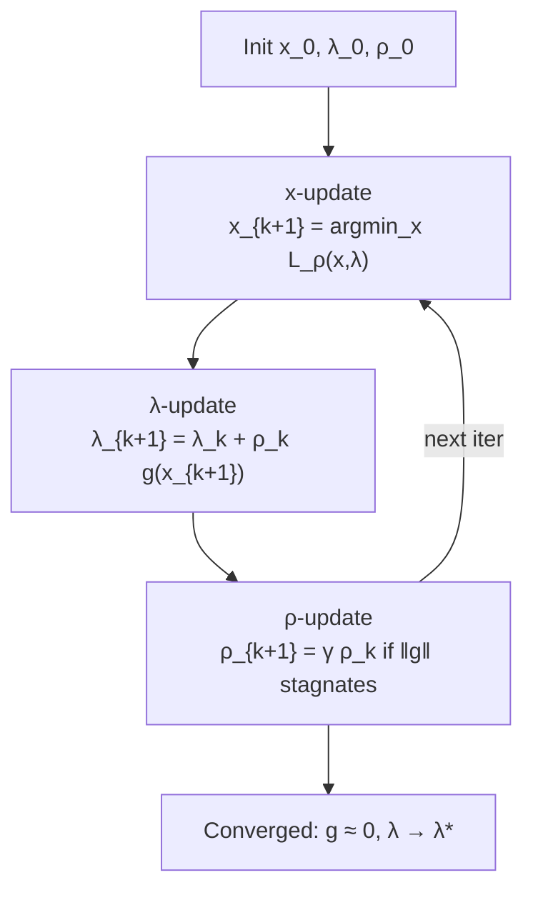
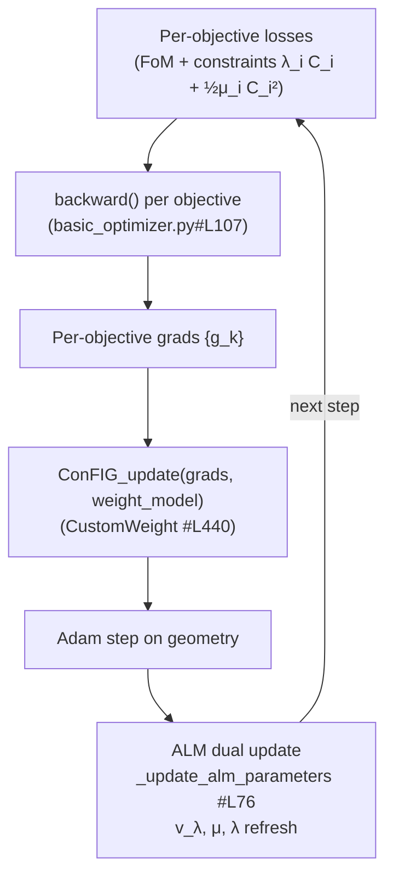

# ALM & Conflict-Free Multi-Objective Optimization

## Definition

Two complementary techniques turn a constrained, multi-objective
geometry optimisation into a stable stochastic-gradient loop inside
[utils-basic_optimizer](../modules/utils-basic_optimizer.md):

- **Augmented Lagrangian Method (ALM)** — a classical constrained
  optimiser (Hestenes 1969; Powell 1969; Nocedal & Wright, *Numerical
  Optimization*, ch. 17) that combines a quadratic penalty with a
  Lagrange-multiplier estimate. It enforces constraints such as
  detector boundary, inter-string repulsion and spacing without the
  ill-conditioning of pure penalty methods.
- **Conflict-free gradient descent** — a multi-task-learning technique
  (ConFIG, Liu et al. 2024; related: PCGrad, Yu et al. 2020; MGDA,
  Désidéri 2012; Sener & Koltun 2018) that replaces the naive
  weighted-sum gradient with a direction guaranteed to be
  non-increasing for every objective when such a direction exists.

## Mathematical formulation

### Augmented Lagrangian

For a primal problem

```
min_x  f(x)      s.t.  g_i(x) ≤ 0,  i = 1..m
```

the augmented Lagrangian (equality form, slackened via a `max` or
sigmoid barrier for inequalities) is

```
L_ρ(x, λ) = f(x) + Σ_i λ_i g_i(x) + (ρ/2) Σ_i g_i(x)^2
```

Classical ALM alternates

```
x_{k+1}  = argmin_x L_{ρ_k}(x, λ_k)            (inner loop: SGD/Adam)
λ_{k+1}  = λ_k + ρ_k g(x_{k+1})                (dual ascent)
ρ_{k+1}  = γ ρ_k  if ‖g‖ not improved          (penalty update)
```

This combines the unbiased stationarity of Lagrange multipliers with
the convexifying effect of the quadratic penalty: as `λ → λ*`,
finite `ρ` suffices (no `ρ → ∞` as in pure penalty methods).

### nugget's adaptive ALM

The implementation in
[`_update_alm_parameters`](../../nugget/utils/basic_optimizer.py#L76)
uses an **RMSprop-style** update on the penalty `μ` (nugget's symbol
for `ρ`) rather than geometric growth:

```
v_λ        ← α · v_λ + (1 − α) · C(θ)^2                (moving average)
μ          ← γ / ( √v_λ + ε )                          (bounded by μ_min, μ_max)
λ          ← clip( λ + μ · C(θ),  λ_min, λ_max )       (dual ascent)
```

with hyperparameters `γ, α, ε, λ_min, λ_max, μ_min, μ_max` supplied
via `alm_params` (see
[`__init__`](../../nugget/utils/basic_optimizer.py#L12) and
[`_initialize_alm_parameters`](../../nugget/utils/basic_optimizer.py#L61)).
Each constraint listed in `constraints_list` — a subset of the losses
from [losses-geometry_penalties](../modules/losses-geometry_penalties.md)
(`BoundaryPenalty`, `StringBoundaryPenaltyCircle`, `RepulsionPenalty`,
`LocalRepulsionPenalty`, …) — carries its own `(λ_i, μ_i)` pair.

Each training step the constraint term contributed to the backward
pass is `λ_i C_i(θ) + ½ μ_i C_i(θ)^2`; after the parameter update
`λ_i, μ_i` are refreshed.

### Conflict-free gradients (ConFIG)

Given per-objective gradients `{g_1, …, g_K}`, a naive sum
`Σ w_i g_i` can have negative inner product with some `g_i` —
increasing that loss. ConFIG finds a direction `d` such that

```
⟨d, g_i⟩ ≥ 0   for all i
```

by projecting gradients against the unit vectors of others and
rescaling, then mixing with user-specified weights. Related methods:

- **PCGrad** (Yu et al. 2020) — project `g_i` onto the normal plane
  of any conflicting `g_j`.
- **MGDA** (Désidéri 2012; Sener & Koltun 2018) — solve a small QP
  for Pareto-stationary direction.

In nugget, ConFIG is dispatched via the `conflictfree` package in
[`loss_update_step`](../../nugget/utils/basic_optimizer.py#L107):

```python
g_config = ConFIG_update(grads, weight_model=weight_model)
geo_aspect.grad = g_config.view_as(...)
```

with either `EqualWeight` or the
[`CustomWeight`](../../nugget/utils/basic_optimizer.py#L440) model,
which honours user `loss_weights_dict`.

## Diagrams

### (a) Classical ALM loop



### (b) nugget `loss_update_step`



## Why it matters for detector optimization

A neutrino-telescope geometry optimiser typically juggles:

1. A **figure of merit** (Fisher/LLR from a surrogate, see
   [surrogate-modeling](surrogate-modeling.md)) — the true physics
   objective.
2. **Hard geometric constraints** — detector footprint, minimum DOM
   spacing, site-specific exclusion zones.
3. **Soft regularizers** — repulsion, smoothness, cost.

Pure penalty weighting forces a manual trade-off sweep and tends to
stall: large penalty weights ill-condition the Fisher direction;
small weights violate constraints. ALM fixes this by learning the
right multiplier automatically. ConFIG independently fixes the second
failure mode — the FoM gradient and repulsion/boundary gradients
often point in conflicting directions near the feasible boundary,
where a weighted sum cancels progress on the FoM.

The combination — ALM for constraint satisfaction + ConFIG for
multi-FoM direction finding — lets nugget optimise complex layouts
(TRIDENT, P-ONE, KM3NeT-style arrays) with minimal
hyperparameter tuning.

## Usage in nugget

- [`Optimizer.__init__`](../../nugget/utils/basic_optimizer.py#L12) —
  flags `conflict_free`, `use_custom_cf_weight`, `use_alm`,
  `alm_params`.
- [`_initialize_alm_parameters`](../../nugget/utils/basic_optimizer.py#L61) —
  one `λ, μ` pair per constraint.
- [`_update_alm_parameters`](../../nugget/utils/basic_optimizer.py#L76) —
  adaptive multiplier update.
- [`loss_update_step`](../../nugget/utils/basic_optimizer.py#L107) —
  per-objective backward, `ConFIG_update`, Adam step, then ALM update.
- [`CustomWeight.get_weights`](../../nugget/utils/basic_optimizer.py#L452) —
  plugs user weights into ConFIG.
- Constraint losses live in
  [losses-geometry_penalties](../modules/losses-geometry_penalties.md):
  [BoundaryPenalty](../../nugget/losses/geometry_penalties.py#L5),
  [StringBoundaryPenaltyCircle](../../nugget/losses/geometry_penalties.py#L76),
  [RepulsionPenalty](../../nugget/losses/geometry_penalties.py#L114),
  [LocalRepulsionPenalty](../../nugget/losses/geometry_penalties.py#L157).
- Example run:
  [example-uniform_rov_alm_test](../entities/example-uniform_rov_alm_test.md).

## Further reading

- [Wikipedia — Augmented Lagrangian method](https://en.wikipedia.org/wiki/Augmented_Lagrangian_method)
- [Nocedal & Wright — Numerical Optimization, 2nd ed., ch. 17](https://link.springer.com/book/10.1007/978-0-387-40065-5)
- [Liu, Wang, Thuerey 2024 — ConFIG: Conflict-Free Inverse Gradients](https://arxiv.org/abs/2408.11104)
- [Yu et al. 2020 — Gradient Surgery for Multi-Task Learning (PCGrad)](https://arxiv.org/abs/2001.06782)
- [Sener & Koltun 2018 — Multi-Task Learning as Multi-Objective Optimization (MGDA)](https://proceedings.neurips.cc/paper/2018/hash/432aca3a1e345e339f35a30c8f65edce-Abstract.html)
- [Désidéri 2012 — Multiple-gradient descent algorithm (MGDA)](https://doi.org/10.1016/j.crma.2012.03.014)

## See also

- [surrogate-modeling](surrogate-modeling.md)
- [losses-geometry_penalties](../modules/losses-geometry_penalties.md)
- [utils-basic_optimizer](../modules/utils-basic_optimizer.md)
- [llr](llr.md)
