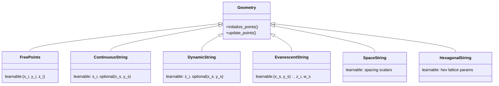

# Detector Geometry

## Definition

A **detector geometry** in `nugget` is a differentiable parameterization of
the 3D positions of optical sensors (DOMs / PMTs) in a large-volume
neutrino telescope, together with the minimal metadata needed to compute
physics losses (light yield, trigger, Fisher information) and apply
engineering penalties (minimum string spacing, vertical extent, etc.).

All geometries inherit from `Geometry`
([base_geometry.py L8](../../nugget/geometries/base_geometry.py#L8))
and expose a common two-phase contract:

1. `initialize_points(**kw)` — build the initial point cloud and register
   the subset of coordinates that are **learnable** `nn.Parameter`s.
2. `update_points(**kw)` — rebuild the output dict from the current
   parameter values every optimization step.

The standardized output dict
([modules/geometries.md](../modules/geometries.md))

```
{ 'points_3d': (N,3), 'string_xy': (S,2), 'z_values': (N,),
  'string_indices': ..., 'points_per_string_list': ..., ... }
```

lets every downstream loss consume any strategy interchangeably.

## Formal / mathematical description

### Design variables

Let the detector have `S` strings and `M` DOMs per string (possibly
variable). The full coordinate vector is

```
X ∈ R^(N×3),   N = Σ_s M_s
```

Strategies differ in which subset of `X` is a learnable parameter
`θ ⊂ X`; the rest is either fixed by a lattice rule or derived from a
lower-dimensional parameter.

| Strategy | θ (learnable) | Fixed / derived | Source |
|---|---|---|---|
| [FreePoints](../modules/geometries-FreePoints.md) | all `(x_i,y_i,z_i)` | none | `FreePoints.py` |
| [ContinuousString](../modules/geometries-ContinuousString.md) | path arc-length positions `s_i`, optional string `(x,y)` | `z = f(s)` along a smooth curve | `ContinuousString.py` |
| [DynamicString](../modules/geometries-DynamicString.md) | per-DOM `z_i`, optional string `(x,y)` | string `(x,y)` from a hex/sunflower grid | `DynamicString.py` |
| [EvanescentString](../modules/geometries-EvanescentString.md) | `(x_s,y_s)`, `z_i`, per-string weights `w_s` | — | `EvanescentString.py` |
| [SpaceString](../modules/geometries-SpaceString.md) | string spacing scalar(s), optionally `z` | hex lattice shape | `SpaceString.py` |

### Diagram



### Lattice primitives

Strings are seeded from closed-form 2D lattices in
[base_geometry.py](../../nugget/geometries/base_geometry.py):

- **Hexagonal rings** — `1 + 3 r (r+1)` points after `r` rings;
  used by IceCube-like layouts.
  [L47](../../nugget/geometries/base_geometry.py#L47)
- **Circular-hexagonal crop** — hex lattice clipped to a disk
  [L207](../../nugget/geometries/base_geometry.py#L207)
- **Sunflower / Vogel spiral** — golden-angle
  `φ = π (3 − √5) ≈ 137.508°`, radius `r_k = c √k`.
  Produces near-uniform Voronoi areas with no preferred direction.
  [L325](../../nugget/geometries/base_geometry.py#L325)
- **Hybrid hex↔sunflower** — interpolates between the two using
  Hungarian matching.
  [L373](../../nugget/geometries/base_geometry.py#L373)

Every grid uses a binary search over the spacing scalar so the output
hits an exact target point count inside a requested domain.

### Constraints

Physical constraints are imposed as differentiable soft penalties
([losses-geometry_penalties](../modules/losses-geometry_penalties.md))
rather than hard projections, so gradient-based optimization stays
unconstrained in the interior.

## Context: why stringed geometries dominate in neutrino telescopes

Giga-ton Cherenkov detectors (IceCube, KM3NeT/ARCA+ORCA, P-ONE,
Baikal-GVD) instrument either glacial ice or deep seawater with PMTs
housed in pressure spheres. Deployment is done from the **surface only**:

- In ice, a hot-water drill makes a vertical hole and a cable of DOMs is
  frozen in.
- In water, an anchored cable is released from a ship; buoyancy pulls it
  vertical.

Both techniques permit essentially **one free deployment parameter per
string** (its surface `(x,y)`) plus an engineered vertical DOM spacing.
The 2D string layout, DOM spacing, and string count therefore span the
entire realistic design space — motivating the reduced-dimension
parameterizations above.

IceCube uses a ~125 m triangular lattice with 60 DOMs / 17 m spacing
(125 m × 60 × 17 m ≈ 1 km³); KM3NeT uses 18 DOMs on flexible vertical
lines ~90 m apart; P-ONE proposes ~70 strings, 20 modules each in the
Cascadia Basin; Baikal-GVD uses ~2600 OMs on strings ~60 m apart. All
are captured as instances of the strategies above.

## Usage in `nugget`

- Strategy selection happens at training-script construction time; every
  loss — [trigger](trigger.md), Fisher information, effective area —
  consumes the common output dict.
- `compare_geometries`
  ([base_geometry.py L536](../../nugget/geometries/base_geometry.py#L536))
  uses [Hungarian matching](hungarian-matching.md) to score pre/post
  optimization distance.
- `create_hybrid_hex_sunflower_grid`
  ([L373](../../nugget/geometries/base_geometry.py#L373)) uses the same
  matcher to interpolate between lattice families.
- Penalties such as minimum-spacing and z-extent live in
  [losses-geometry_penalties](../modules/losses-geometry_penalties.md).

Internal index: [modules/geometries](../modules/geometries.md),
strategy pages linked in the table above.

## Further reading

- [IceCube Neutrino Observatory — Wikipedia](https://en.wikipedia.org/wiki/IceCube_Neutrino_Observatory)
- [KM3NeT — Wikipedia](https://en.wikipedia.org/wiki/KM3NeT)
- [The IceCube Neutrino Observatory: Instrumentation and Online Systems (Aartsen et al. 2017, arXiv:1612.05093)](https://arxiv.org/abs/1612.05093)
- [Letter of Intent for KM3NeT 2.0 (arXiv:1601.07459)](https://arxiv.org/abs/1601.07459)
- [Baikal-GVD overview (arXiv:2005.09493)](https://arxiv.org/abs/2005.09493)
- [Pacific Ocean Neutrino Experiment (P-ONE) strategy (arXiv:2108.04310)](https://arxiv.org/abs/2108.04310)

## See also

- [string-parameterization](string-parameterization.md)
- [hungarian-matching](hungarian-matching.md)
- [trigger](trigger.md)
- [modules/geometries](../modules/geometries.md)
