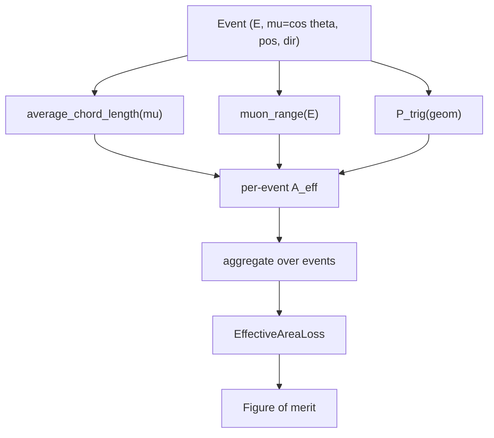

# Effective Area

## Definition

The **neutrino (or muon) effective area** `A_eff(E, Ω)` is the
equivalent geometric area of a perfect detector that would collect the
same event rate as the real instrument, given incoming particle energy
`E` and direction `Ω`. The observed rate from a flux `Φ(E,Ω)` is

```
  R = ∫ dE dΩ  Φ(E, Ω) · A_eff(E, Ω)
```

For a through-going muon channel, `A_eff` factorises into a geometric
cross-section (projected detector area along the track direction)
times a detection efficiency that depends on the muon range in the
medium and on the trigger requirement.

## Mathematical formulation

### Geometric projection: chord through a vertical cylinder

For a cylindrical instrumented volume of radius `R` and height `H`
pierced by tracks with zenith `θ` (`μ = cos θ`), the *average chord
length* is the standard convex-body result

```
                    H/|μ|
  ℓ̄(μ) = R · ─────────────────────────        (μ ≠ 0)
              R/(H/|μ|) + (2/π)·√(1 − μ²)

  ℓ̄(μ = 0) = π R / 2                         (horizontal)
```

Implemented in
[`average_chord_length`](../../nugget/losses/effective_area.py#L35),
with the `μ = 0` branch handled separately to preserve
differentiability.

### Muon range

The continuous-slowing-down range of a muon of energy `E` in a medium
of density `ρ` follows the MMC parametrisation

```
  X(E) = (1 / b) · ln( 1 + E · b / a ),
         a = 0.212 / ρ   [GeV / (g/cm²) → m]
         b = 0.251·10⁻³ / ρ  [(g/cm²)⁻¹ → m⁻¹]
```

Implemented in
[`muon_range`](../../nugget/losses/effective_area.py#L25). The range
cutoff `range_cutoff(E, d_edge)` suppresses events whose muon stops
before reaching the detector fiducial volume.

### Effective area integral

In the `nugget` track-channel approximation:

```
  A_eff(E, μ) ≈ ℓ̄(μ) · P_trig(E, geometry) · Θ(X(E) − d_edge)
```

and the loss aggregates over strings / test-points:

```
  A_eff ≈ Σ_strings  P_hit(track hits string)
                   · chord(μ, geom)
                   · range_cutoff(E, d_edge)
```

See
[effective_area.py:~L100+](../../nugget/losses/effective_area.py#L100)
(`EffectiveAreaLoss`). Smooth extrema are used to keep the objective
differentiable — `_softmax_max`/`_softmax_min` at
[L70](../../nugget/losses/effective_area.py#L70) implement
temperature-controlled log-sum-exp approximations of `max`/`min`.

### Track parameter extraction

[`_extract_track_from_event_params`](../../nugget/losses/effective_area.py#L82)
accepts either an explicit `direction` vector or `(zenith, azimuth)`
or `(cos_zenith, azimuth)` pairs and returns a `(point, unit_dir)`
description of the infinite track.

### Diagram



## Physics context

- `A_eff` is the standard figure-of-merit for point-source and
  diffuse-flux sensitivity of neutrino telescopes (IceCube, KM3NeT,
  P-ONE). Combined with observation time it gives the expected signal
  count.
- For **upgoing** muons the Earth filters atmospheric muons but
  attenuates high-energy neutrinos — this multiplies `A_eff` by a
  transmission factor that `nugget` does not model directly; the
  effective-area loss here is the *instrumental* acceptance.
- `nugget` uses `A_eff` as a *geometry-optimisation* objective: by
  making chord length, range cutoff and per-string hit-probability
  differentiable in the string positions and depths, gradient descent
  can maximise point-source sensitivity together with
  [fisher-information](fisher-information.md) in the combined
  [figure-of-merit](figure-of-merit.md).

## Usage in nugget

- Primary module:
  [losses-effective_area](../modules/losses-effective_area.md) →
  [effective_area.py](../../nugget/losses/effective_area.py).
- Raw-source landmarks:
  - `muon_range` —
    [L25](../../nugget/losses/effective_area.py#L25).
  - `average_chord_length` —
    [L35](../../nugget/losses/effective_area.py#L35).
  - `_softmax_max / _softmax_min` —
    [L70](../../nugget/losses/effective_area.py#L70).
  - `_extract_track_from_event_params` —
    [L82](../../nugget/losses/effective_area.py#L82).
- Dependencies: `trigger.TriggerLoss`
  ([trigger](trigger.md)) supplies `P_trig`;
  `samplers.cyl_sampler.CylinderSampler` generates track origins.
- Combined objective:
  [losses-pointsource_fom](../modules/losses-pointsource_fom.md),
  [figure-of-merit](figure-of-merit.md).

## Further reading

- D. Chirkin & W. Rhode, *Muon Monte Carlo: a high-precision tool for
  muon propagation through matter*,
  [arXiv:hep-ph/0407075](https://arxiv.org/abs/hep-ph/0407075) — MMC,
  source of the `(a, b)` range parametrisation.
- IceCube Collaboration, *The IceCube Neutrino Observatory:
  Instrumentation and Online Systems*,
  [arXiv:1612.05093](https://arxiv.org/abs/1612.05093).
- KM3NeT Collaboration, *Determining the neutrino mass ordering and
  oscillation parameters with KM3NeT/ORCA*,
  [arXiv:2103.09885](https://arxiv.org/abs/2103.09885).
- P-ONE Collaboration, *The Pacific Ocean Neutrino Experiment*,
  [arXiv:2008.04323](https://arxiv.org/abs/2008.04323).
- [Muon — Wikipedia](https://en.wikipedia.org/wiki/Muon) (range and
  energy-loss overview).

## See also

- [light-yield](light-yield.md)
- [trigger](trigger.md)
- [figure-of-merit](figure-of-merit.md)
- [fisher-information](fisher-information.md)
- [losses-effective_area](../modules/losses-effective_area.md)
