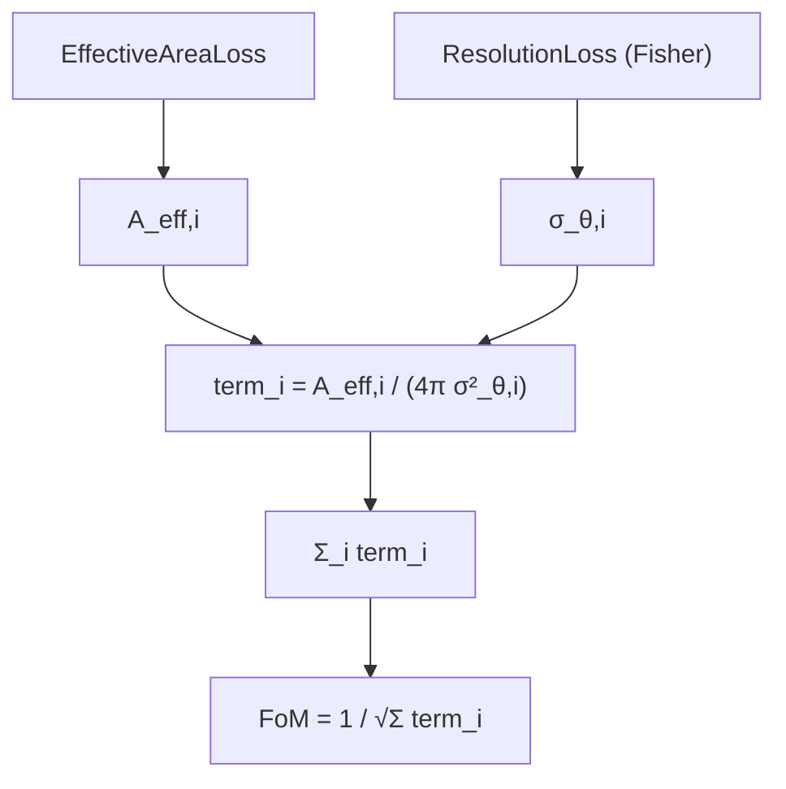

# Point-Source Figure of Merit

## Definition

A **figure of merit (FoM)** is a scalar that summarizes detector
performance for a specific science goal. For steady point-source
searches in neutrino telescopes the canonical FoM combines two
ingredients:

1. **Effective area** `A_eff(E, δ)` — the flux-averaged probability
   per unit area that a neutrino is detected and passes selection.
2. **Angular resolution** `σ_θ(E, δ)` — the RMS pointing error of
   reconstructed events around the true source direction.

Heuristically, the number of signal events scales with `A_eff` while
the background in a signal-like PSF cone scales with `σ_θ²`. The
signal-to-noise-like quantity `A_eff / σ_θ²` is therefore
proportional to the squared significance per unit flux. IceCube,
KM3NeT and IceCube-Gen2 studies routinely adopt proxies of this
form (or the full sensitivity flux, i.e. the 90% upper-limit flux
under the no-signal hypothesis) to compare geometries and event
selections.

## Mathematical formulation

For a point source observed with a set of MC events `{i}` drawn
from the expected spectrum:

```
FoM = 1 / sqrt( Σ_i  A_eff,i / (4π σ²_θ,i) )
```

This is a monotonically decreasing function of the effective
sensitivity, so `FoM` can be used directly as a loss. Unpacking:

- `A_eff,i` — per-event contribution to the effective area, as
  produced by the nugget effective-area loss (see
  [effective-area](effective-area.md)).
- `4π σ²_θ,i` — solid-angle PSF element; assumes Gaussian-like
  residuals, which is accurate enough for optimization even when
  the true PSF has tails.
- Sum over events approximates the Monte-Carlo integral over the
  source-weighted energy and zenith spectrum.

Equivalently, defining per-event "quality"
`q_i = A_eff,i / (4π σ²_θ,i)`, the FoM is `1 / sqrt(Σ q_i)`. The
1/√Σ form keeps the loss bounded and shares curvature with the
Fisher combined resolution (see
[fisher-information](fisher-information.md)).

## Diagram



## Why it matters in neutrino telescopy

- **Design trade-offs.** Spreading strings out increases `A_eff`
  at high energies but can degrade `σ_θ` (fewer hits per event);
  packing them in improves `σ_θ` but kills volume. A single FoM
  enables end-to-end gradient descent on geometry parameters.
- **Comparison across analyses.** IceCube's point-source papers
  quote sensitivity curves in `A_eff` and median `σ_θ` versus
  declination; `A_eff/σ_θ²` encodes both in one number and matches
  the asymptotic significance scaling derived from unbinned
  likelihood analyses.
- **Forecasting.** IceCube-Gen2 and next-generation water/ice
  detectors (KM3NeT, P-ONE, TRIDENT) use FoMs of this family to
  motivate geometry choices long before full end-to-end simulations
  are available.

## How it appears in the nugget codebase

- [`losses-pointsource_fom`](../modules/losses-pointsource_fom.md)
  implements `FoMLoss`
  ([pointsource_fom.py:8](../../nugget/losses/pointsource_fom.py#L8)).
  It internally instantiates:
  - `ResolutionLoss` / `WeightedResolutionLoss`
    (see [losses-fisher_info](../modules/losses-fisher_info.md))
    for `σ_θ,i`, gated by `use_weighted_resolution`;
  - `EffectiveAreaLoss`
    (see [losses-effective_area](../modules/losses-effective_area.md))
    for `A_eff,i`.
- `FoMLoss._get_events` normalizes the two accepted input forms —
  explicit event parameter lists or a sampler — and forwards
  shared kwargs (`llr_net`, `fisher_info_params`,
  `signal_surrogate_func`, …) to the composed sub-losses.
- The combination happens in the final reduction
  `term_i = A_eff,i / (4π σ²_θ,i)` then `FoM = 1 / sqrt(Σ term_i)`,
  which is differentiable end-to-end and drives geometry gradients
  via the chain rule through `LLRnet`.

## Further reading

- [IceCube point-source sensitivity, ICRC 2009 (arXiv 1003.5715)](https://arxiv.org/pdf/1003.5715)
- [Lowering IceCube's energy threshold for southern point sources (arXiv 1605.00163)](https://arxiv.org/abs/1605.00163)
- [IceCube all-sky point-source data release 2012–2015](https://icecube.wisc.edu/data-releases/2020/02/all-sky-point-source-icecube-data-years-2012-2015/)
- [The IceCube-Gen2 Neutrino Observatory (arXiv 2108.05292)](https://arxiv.org/pdf/2108.05292)
- [Improved IceCube pointing algorithm (2021)](https://icecube.wisc.edu/news/research/2021/04/new-algorithm-improves-icecubes-pointing-accuracy/)

## See also

- [llr](llr.md)
- [fisher-information](fisher-information.md)
- [effective-area](effective-area.md)
- [losses-pointsource_fom](../modules/losses-pointsource_fom.md)
- [losses-fisher_info](../modules/losses-fisher_info.md)
- [losses-effective_area](../modules/losses-effective_area.md)
