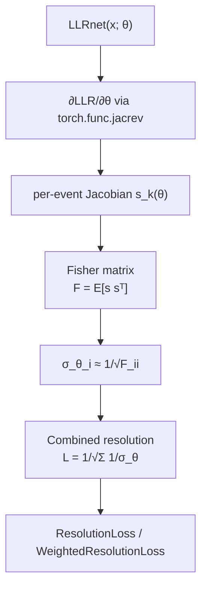

# Fisher Information & Angular Resolution

## Definition

The **Fisher information matrix** `F(θ)` quantifies how sharply a
likelihood `p(x | θ)` peaks in the parameter `θ`. Formally, for a
differentiable statistical model,

```
F_ij(θ) = E_x [ (∂ log p / ∂θ_i) (∂ log p / ∂θ_j) ]
        = − E_x [ ∂² log p / (∂θ_i ∂θ_j) ]
```

The **Cramér–Rao bound** states that any unbiased estimator `θ̂`
satisfies `Cov(θ̂) ⪰ F⁻¹(θ)`. In the large-sample limit the maximum-
likelihood estimator saturates this bound, so `F⁻¹` is the canonical
predictor of achievable resolution — before any data are collected.

For a nuisance-free two-hypothesis problem, differentiating the
log-likelihood-ratio `LLR(x; θ) = log p(x|θ) − log p(x|θ_0)` with
respect to `θ` gives the same score, so Fisher information can be
computed directly from a trained LLR surrogate.

## Mathematical formulation

For per-event angular / directional parameters `θ = (zenith,
azimuth, …)`:

```
s_k(θ)   = ∂ LLR(x_k; θ) / ∂θ            (score)
F(θ)     = E_x [ s s^T ]
σ²_θ_i   = (F⁻¹)_{ii}                     (marginal CRB)
```

When the off-diagonals are small, or when only diagonal resolutions
are needed, the shortcut `σ_θ_i ≈ 1 / sqrt(F_ii)` is commonly used.
Nugget uses this diagonal approximation.

Aggregating resolutions across a set of events:

```
L = 1 / sqrt( Σ_events 1 / σ_θ )
```

acts as a smooth "combined resolution" that is bounded, monotone in
individual `σ_θ`, and differentiable w.r.t. geometry.

## Diagram



## Why it matters in neutrino telescopy

Angular resolution drives essentially every astrophysical use of a
neutrino telescope: point-source searches (smaller PSF ⇒ smaller
background cone), multimessenger follow-up, stacking analyses, and
galactic-plane mapping. Published IceCube median resolutions for
through-going muons are around 0.3°–2° depending on energy;
improving them by even tens of percent (as with the 2021 pointing
upgrade) translates directly into discovery reach. Classical
Fisher-matrix studies (in cosmology, CMB, and neutrino experiments
alike) let designers forecast resolution and parameter degeneracies
before running expensive end-to-end reconstructions.

For geometry optimization specifically, the Fisher-information
resolution is an ideal surrogate objective because:

- it is a *local* quantity at truth parameters, so it avoids the
  combinatorial cost of full reconstruction;
- it is differentiable via autograd when the likelihood is given by
  a neural surrogate;
- it saturates the Cramér–Rao bound in the asymptotic regime that
  high-statistics source analyses live in.

## How it appears in the nugget codebase

- [`losses-fisher_info`](../modules/losses-fisher_info.md) implements
  per-event Fisher resolution on top of a trained `LLRnet`.
- The core Jacobian is computed in `_fisher_one_point_jacrev`
  ([fisher_info.py:89](../../nugget/losses/fisher_info.py#L89))
  using `torch.func.jacrev` (with `vmap` and `linearize` for chunked
  GPU evaluation). The helper
  `_llr_out_single_point_all_iters`
  ([fisher_info.py:59](../../nugget/losses/fisher_info.py#L59))
  wraps the surrogate call so that the Jacobian is taken w.r.t. the
  requested `fisher_info_params` (e.g. `['zenith', 'azimuth']`).
- `ResolutionLoss` aggregates across the full detector;
  `WeightedResolutionLoss` applies sigmoid weights on a per-string
  basis (requires `string_xy`, `points_per_string_list`).
- Masking helpers (`_llr_mask_from_true_ly`, chunk cleanup) discard
  zero-light-yield points where the gradient is numerically ill-
  defined. Domain-size normalization
  (`_pos_norm_divisor_from_domain_size`,
  [fisher_info.py:14](../../nugget/losses/fisher_info.py#L14))
  rescales position parameters so that `F_ii` is dimensionally
  consistent across geometry coordinates.
- Downstream, [`losses-pointsource_fom`](../modules/losses-pointsource_fom.md)
  composes `σ_θ` with the effective area to produce the nugget
  point-source figure of merit (see
  [figure-of-merit](figure-of-merit.md)).

## Further reading

- [Fisher information — Wikipedia](https://en.wikipedia.org/wiki/Fisher_information)
- [Cramér–Rao bound — Wikipedia](https://en.wikipedia.org/wiki/Cram%C3%A9r%E2%80%93Rao_bound)
- [Stanford Stats 200, Lecture 15 — Fisher information and CRB](https://web.stanford.edu/class/stats200/Lecture15.pdf)
- [Fisher information and CRB for compressive sensing (arXiv 1504.01081)](https://arxiv.org/pdf/1504.01081)
- [Likelihood, Fisher information, and systematics of CMB experiments (A&A 2012)](https://www.aanda.org/articles/aa/full_html/2012/06/aa19293-12/aa19293-12.html)

## See also

- [llr](llr.md)
- [figure-of-merit](figure-of-merit.md)
- [losses-fisher_info](../modules/losses-fisher_info.md)
- [surrogates-LLRnet](../modules/surrogates-LLRnet.md)
