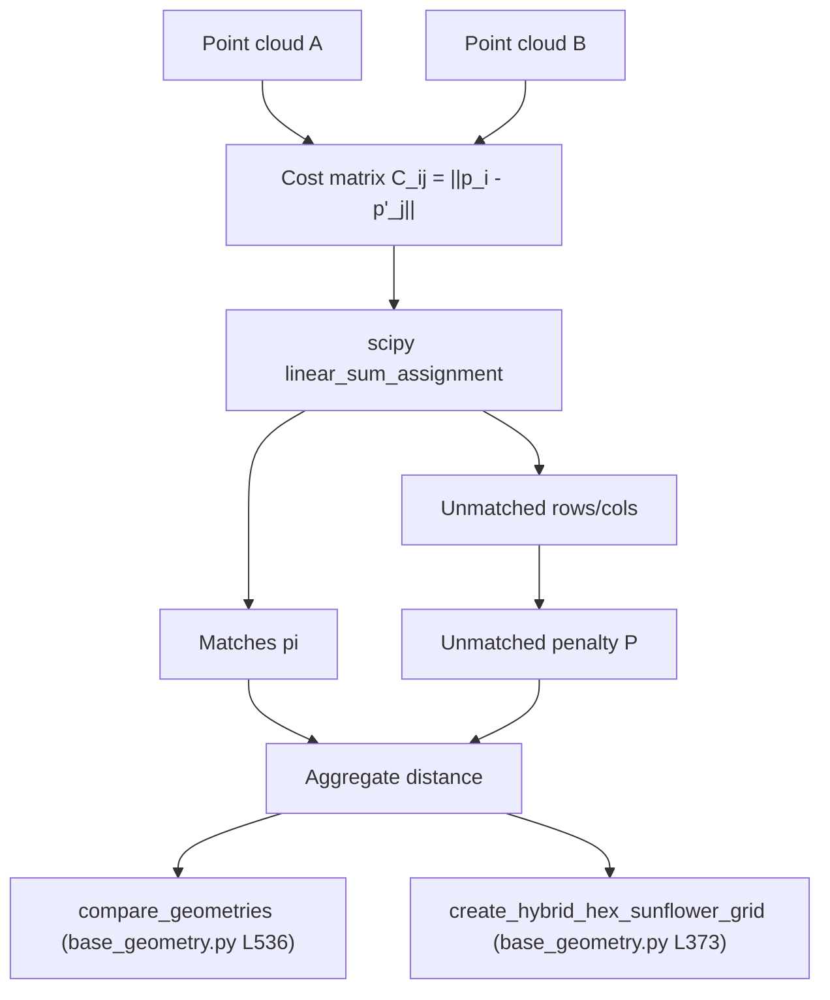

# Hungarian Matching

## Definition

The **Hungarian algorithm** (Kuhn 1955, refined by Munkres 1957) solves
the **linear assignment problem**: given a real cost matrix
`C ∈ R^(n×m)`, find a one-to-one assignment that minimizes total cost.
`nugget` uses it through
[`scipy.optimize.linear_sum_assignment`](https://docs.scipy.org/doc/scipy/reference/generated/scipy.optimize.linear_sum_assignment.html),
which implements a modernized Jonker–Volgenant variant in `O(n³)` and
handles rectangular cost matrices natively.

## Formal / mathematical description

### Assignment problem

Given cost matrix `C ∈ R^(n×m)` with `n ≤ m`, find a matching
`π : {1..n} → {1..m}` (injective) that minimizes

```
J(π) = Σ_{i=1}^{n}  C_{i, π(i)}.
```

Equivalently, with assignment matrix `X ∈ {0,1}^(n×m)`:

```
minimize  Σ_{i,j} C_{ij} X_{ij}
s.t.      Σ_j X_{ij} = 1  ∀ i,
          Σ_i X_{ij} ≤ 1  ∀ j,
          X_{ij} ∈ {0,1}.
```

The LP relaxation has integral vertices (costrix-matrix is totally
unimodular), so linear programming already returns a valid permutation.

### Kuhn–Munkres (O(n³))

Maintain dual potentials `u_i, v_j` with `u_i + v_j ≤ C_{ij}`, and grow
an equality subgraph `{(i,j) : u_i + v_j = C_{ij}}` augmenting paths
until a perfect matching exists. Each of the `n` augmentations costs
`O(n²)`, giving the cubic bound. Jonker–Volgenant uses shortest-path
augmentations with Dijkstra, yielding the same worst case but better
constants on sparse / rectangular inputs.

### Rectangular case (unequal set sizes)

When `n ≠ m`, `linear_sum_assignment` returns a matching of size
`min(n,m)`. `nugget` handles this by (a) padding the cost matrix with a
fixed **unmatched penalty** or (b) adding the penalty post-hoc to
unmatched rows/columns:

```
P ∈ {domain_diagonal, max_distance, mean_distance, float}.
```

See
[`compare_geometries`](../modules/geometries-base_geometry.md)
([base_geometry.py L536](../../nugget/geometries/base_geometry.py#L536)).

### Diagram



## Context

Hungarian matching is the natural metric between two point clouds that
represent the **same physical objects** (DOMs) under reordering
ambiguity. It is the discrete analogue of the 2-Wasserstein / optimal
transport distance when every point has unit mass, and is exact (not a
greedy approximation).

In neutrino-telescope design-space exploration we repeatedly need:

- **Pre/post comparison** — how much did the optimizer actually move the
  detector? Chamfer distance over-counts; nearest-neighbor is asymmetric
  and not a metric; Hungarian is symmetric and respects the *one DOM
  per physical DOM* constraint.
- **Lattice blending** — interpolating between two candidate lattices
  (hex ↔ sunflower) along a curve requires *corresponding* DOMs at
  each blend step `α`. The matching at `α=0` dictates the convex
  combination `α · p^(hex)_i + (1−α) · p^(sunflower)_{π(i)}`.
- **Benchmark scoring** — distance to a reference IceCube or KM3NeT
  layout, summarized in one scalar.

## Usage in `nugget`

Two call sites:

1. `compare_geometries(g1, g2, ...)` —
   [base_geometry.py L536](../../nugget/geometries/base_geometry.py#L536).
   Builds `C_{ij} = ||p^(1)_i − p^(2)_j||`, optionally divided by the
   product of per-point [string weights](string-parameterization.md) for
   evanescent geometries, runs `linear_sum_assignment`, then augments
   with per-point penalties. Returns `average_distance`,
   `matched_average_distance`, `total_distance`, `matches`, `distances`,
   `n_matched`, `n_unmatched`, `penalty_contribution`.
   Concept page: [detector-geometry](detector-geometry.md).
2. `create_hybrid_hex_sunflower_grid(...)` —
   [base_geometry.py L373](../../nugget/geometries/base_geometry.py#L373).
   Matches a hex grid and a same-`N` sunflower grid, then linearly
   interpolates matched pairs to produce a family of lattices
   continuously deformable between the two.

Both consume `scipy.optimize.linear_sum_assignment`, listed in
[modules/geometries](../modules/geometries.md#dependencies).

## Further reading

- [Hungarian algorithm — Wikipedia](https://en.wikipedia.org/wiki/Hungarian_algorithm)
- [Assignment problem — Wikipedia](https://en.wikipedia.org/wiki/Assignment_problem)
- [scipy.optimize.linear_sum_assignment docs](https://docs.scipy.org/doc/scipy/reference/generated/scipy.optimize.linear_sum_assignment.html)
- [Munkres, "Algorithms for the assignment and transportation problems", J. SIAM 5 (1957)](https://dl.acm.org/doi/10.1145/321694.321699)
- [Jonker & Volgenant, "A shortest augmenting path algorithm for dense and sparse linear assignment problems", Computing 38 (1987)](https://link.springer.com/article/10.1007/BF02278710)
- [Optimal transport — Wikipedia](https://en.wikipedia.org/wiki/Optimal_transport)

## See also

- [detector-geometry](detector-geometry.md)
- [string-parameterization](string-parameterization.md)
- [modules/geometries-base_geometry](../modules/geometries-base_geometry.md)
