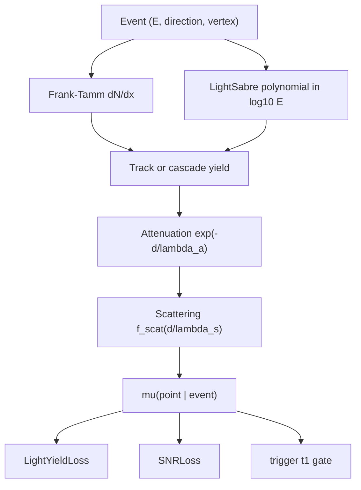

# Light Yield

## Definition

**Light yield** is the expected number of Cherenkov photons (or
photo-electrons) detected at a given sensor point given an event
hypothesis (particle type, energy, position, direction). It is the
*charge* channel of a neutrino telescope's likelihood, complementary to
the *timing* channel captured by the [Pandel PDF](pandel-timing.md).

In `nugget` the light yield is the scalar output `μ(point | event)` of
a surrogate such as [LightSabre](../modules/surrogates-LightSabre.md),
[pandel](../modules/surrogates-pandel.md),
[SkewedGaussian](../modules/surrogates-SkewedGaussian.md), or a learned
[ChargeNet](../modules/surrogates-ChargeNet.md).

## Mathematical formulation

### Frank–Tamm: photons per unit track length

A charged particle moving with velocity `βc > c/n(λ)` in a medium of
refractive index `n(λ)` radiates Cherenkov photons with a differential
spectrum

```
d²N / (dx dλ) = (2π α / λ²) · (1 − 1 / (β² n²(λ)))
```

Integrated over the PMT-sensitive band (e.g. 300–800 nm for deep-water
detectors) this gives the bare photon yield per unit track length
`dN/dx` — ≈ 3.3 × 10⁴ γ/m for a minimum-ionising muon in water, and
≈ 4.78 × 10⁴ γ/m (270–700 nm) for the `WaterModel` fitted in
[notebook-water-model](../entities/notebook-water-model.md).

### Muon-track energy dependence

Stochastic losses (bremsstrahlung, pair-production, photo-nuclear) add
an energy-dependent contribution that scales approximately linearly
with `E_μ` above ~1 TeV. LightSabre parametrises this with a
5-th-order polynomial in `log₁₀(E_μ/GeV)` — see
[LightSabre.py:47–98](../../nugget/surrogates/LightSabre.py#L47):

```
log₁₀( dN/dx [γ/m] ) = Σ_{k=0..5} c_k · (log₁₀ E)^k
```

### Attenuation and geometric factor

Photons travel a distance `d` through the medium before reaching a PMT
of effective photocathode area `A_eff`. The detected light yield is

```
μ(point | event) ≈ (dN/dx) · L_eff · A_eff · cos(η) /
                   (4π d²) · exp(−d / λ_a) · f_scat(d/λ_s)
```

where `λ_a` is the absorption length, `λ_s` the scattering length,
`L_eff` the effective emitter length (track chord or cascade
longitudinal profile), and `f_scat` an effective scattering kernel.

### Loss function

[`LightYieldLoss`](../modules/losses-light_yield.md) maximises the
*total* yield across all points and events by minimising its reciprocal
([light_yield.py:40](../../nugget/losses/light_yield.py#L40)):

```
L = (N_points · N_events) / Σ_e Σ_i μ(point_i | event_e)
```

`WeightedLightYieldLoss`
([light_yield.py:62](../../nugget/losses/light_yield.py#L62)) sums
first per string and weights by `σ(string_weights)` for
string-deployment optimisation.

### Diagram



## Physics context

- **Cherenkov cone half-angle** `cos θ_C = 1 / (β n)`, ≈ 41° in water.
- For muons the yield is dominated by the *track* (Frank–Tamm),
  whereas electromagnetic/hadronic cascades emit isotropically once
  smeared over their longitudinal profile. LightSabre supports both
  via `particle_mode ∈ {'track','cascade'}`
  ([LightSabre.py:65](../../nugget/surrogates/LightSabre.py#L65)).
- The optical medium enters through `(n, λ_a, λ_s)`. The values
  shipped with `WaterModel` are fitted from Smith & Baker 1981 pure-water
  absorption plus Kokhanovsky-model scattering, calibrated against
  STRAW in-situ measurements; see
  [notebook-water-model](../entities/notebook-water-model.md).

## Usage in nugget

- Surrogate producers:
  - [LightSabre.py:8](../../nugget/surrogates/LightSabre.py#L8) —
    physics-based muon-track and cascade yield.
  - [pandel.py:70](../../nugget/surrogates/pandel.py#L70) — `Pandel`
    normalisation is sometimes used as a proxy yield.
- Consumers:
  - [losses-light_yield](../modules/losses-light_yield.md) —
    objective on total detected photons.
  - [losses-SNR](../modules/losses-SNR.md) — signal/noise ratio.
  - [losses-trigger](../modules/losses-trigger.md) — `μ` feeds the
    per-module hit-probability used in the trigger gate.
- Water model: [notebook-water-model](../entities/notebook-water-model.md).

## Further reading

- [Cherenkov radiation — Wikipedia](https://en.wikipedia.org/wiki/Cherenkov_radiation)
- [Frank–Tamm formula — Wikipedia](https://en.wikipedia.org/wiki/Frank%E2%80%93Tamm_formula)
- Aartsen et al. (IceCube), *The IceCube Neutrino Observatory:
  Instrumentation and Online Systems*, JINST 12 P03012 (2017),
  [arXiv:1612.05093](https://arxiv.org/abs/1612.05093).
- Smith & Baker, *Optical properties of the clearest natural waters
  (200–800 nm)*, Applied Optics 20, 177 (1981),
  [optica.org](https://opg.optica.org/ao/abstract.cfm?uri=ao-20-2-177).
- KM3NeT Collaboration, *Determining the neutrino mass ordering and
  oscillation parameters with KM3NeT/ORCA*,
  [arXiv:2103.09885](https://arxiv.org/abs/2103.09885).
- P-ONE Collaboration, *The Pacific Ocean Neutrino Experiment*,
  [arXiv:2008.04323](https://arxiv.org/abs/2008.04323).

## See also

- [pandel-timing](pandel-timing.md)
- [effective-area](effective-area.md)
- [trigger](trigger.md)
- [losses-light_yield](../modules/losses-light_yield.md)
- [surrogates-LightSabre](../modules/surrogates-LightSabre.md)
- [notebook-water-model](../entities/notebook-water-model.md)
