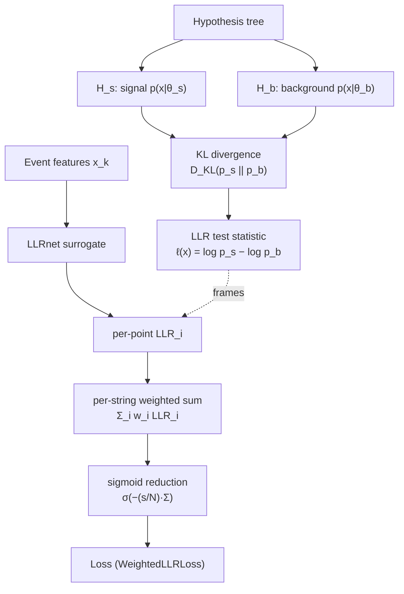

# Log-Likelihood Ratio (LLR)

## Definition

The log-likelihood ratio (LLR) is the logarithm of the ratio of two
probability densities evaluated at the same observation `x`, one
under a "signal" hypothesis `H_s` and one under a "background"
hypothesis `H_b`:

```
LLR(x) = log p(x | H_s) − log p(x | H_b)
```

By the **Neyman–Pearson lemma**, thresholding on LLR yields the
uniformly most powerful test for a simple-vs-simple hypothesis test:
no other statistic achieves higher signal acceptance at fixed
background rejection. For compound hypotheses (e.g. a source with
unknown flux normalization or spectral index) the *generalized* LLR
with profiled nuisance parameters plays the analogous role and is
asymptotically χ²-distributed (Wilks' theorem).

## Mathematical formulation

For a single observation:

```
Λ(x) = p(x | θ_s) / p(x | θ_b)
ℓ(x) = log Λ(x)
```

For N independent observations (e.g. per-hit or per-event):

```
ℓ_tot = Σ_{k=1..N} log p(x_k | θ_s) − log p(x_k | θ_b)
```

Under `H_b`, `E[ℓ] = −D_KL(p_b || p_s)`; under `H_s`,
`E[ℓ] = +D_KL(p_s || p_b)`. The expected separation between
hypotheses therefore grows with the Kullback–Leibler divergence of
the two emission models, which is the quantity a detector geometry
should maximize.

In high-energy neutrino telescopes the densities `p(x | θ)` describe
per-DOM (digital optical module) hit patterns — charge, arrival
time, angular relation to the reconstructed track — conditioned on
event parameters `θ` (direction, energy, vertex, flavour). They are
usually intractable analytically, so modern analyses either tabulate
them (splines over MC) or learn them with neural surrogates; the
nugget project follows the latter path.

## Diagram



## Why it matters in neutrino telescopy

1. **Point-source searches** — IceCube, KM3NeT/ARCA and P-ONE use
   unbinned LLR test statistics combining spatial and energy PDFs to
   assign p-values to candidate astrophysical sources (e.g. the
   4.2σ detection of NGC 1068).
2. **Event classification** — cascade-vs-track, astrophysical-vs-
   atmospheric, and νμ-vs-ν̄μ separation are all LLR tests in
   practice.
3. **Detector optimization** — since the *expected* LLR between two
   physical hypotheses is a monotonic function of discriminative
   power, maximizing it over geometry parameters is equivalent to
   maximizing the detector's asymptotic Neyman–Pearson reach. This
   is precisely what nugget does: it uses LLR (and its derivatives,
   see [fisher-information](fisher-information.md)) as a
   differentiable objective for gradient-based geometry search.

## How it appears in the nugget codebase

- A neural surrogate, [`LLRnet`](../modules/surrogates-LLRnet.md),
  is trained as a binary classifier on simulated signal/background
  hit features. Under the standard cross-entropy optimum its logit
  equals the pointwise LLR (see e.g.
  [LLRnet.py](../../nugget/surrogates/LLRnet.py)). Helpers
  `prepare_data_from_raw` and `predict_log_likelihood_ratio` feed
  detector-geometry-dependent features into the network.
- [`losses-LLR`](../modules/losses-LLR.md) wraps this surrogate into
  differentiable loss functions:
  - `WeightedLLRLoss`
    ([LLR.py:5](../../nugget/losses/LLR.py#L5)) sums LLR per-string,
    gated by sigmoid string weights;
  - `LLRLoss` ([LLR.py:165](../../nugget/losses/LLR.py#L165))
    aggregates per-point;
  - `*MeanDif*` variants target the signal−background contrast.
  The reduction `sigmoid(−(sharpness/N) · Σ_i w_i LLR_i)` turns the
  discriminator score into a smooth scalar loss whose gradient flows
  back into geometry parameters.
- [`losses-fisher_info`](../modules/losses-fisher_info.md) uses
  `torch.func.jacrev` over the same LLR surrogate to obtain
  parameter sensitivities `∂LLR/∂θ`, yielding angular resolution.
- [`losses-pointsource_fom`](../modules/losses-pointsource_fom.md)
  combines LLR-derived resolution with effective area to form a
  point-source figure of merit.

## Further reading

- [Likelihood-ratio test — Wikipedia](https://en.wikipedia.org/wiki/Likelihood-ratio_test)
- [Neyman–Pearson detectors (Nowak lecture notes)](https://nowak.ece.wisc.edu/ece830/ece830_fall11_lecture6.pdf)
- [SkyLLH framework for IceCube point-source searches](https://arxiv.org/abs/2203.07316)
- [IceCube Gen2 benchmark likelihood analysis](https://user-web.icecube.wisc.edu/~jvansanten/gen2_analysis/method.html)
- [icecube_tools — point source likelihood tutorial](https://francescacapel.com/icecube_tools/notebooks/point_source_likelihood.html)
- [Probing particle physics with IceCube (EPJC 2018)](https://link.springer.com/article/10.1140/epjc/s10052-018-6369-9)

## See also

- [fisher-information](fisher-information.md)
- [figure-of-merit](figure-of-merit.md)
- [surrogates-LLRnet](../modules/surrogates-LLRnet.md)
- [losses-LLR](../modules/losses-LLR.md)
- [losses-fisher_info](../modules/losses-fisher_info.md)
