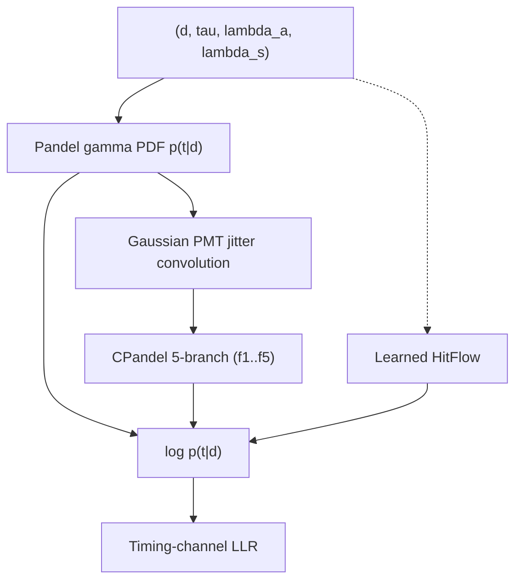

# Pandel timing / PATD

## Definition

The **Photon Arrival Time Distribution (PATD)** is the probability
density `p(t | d)` of the time residual `t` (measured − geometric) of a
Cherenkov photon arriving at a sensor that lies a perpendicular
distance `d` from an infinite muon track in an optical medium. The
**Pandel function** is the analytic gamma-family form originally
derived by D. Pandel (1995 diploma thesis, DESY-Zeuthen / PhD thesis
used by AMANDA/IceCube) that captures the distance-dependent broadening
due to multiple scattering and absorption.

## Mathematical formulation

### The Pandel PDF

```
                ρ^ξ
  p(t | d) = ───────── · t^(ξ − 1) · exp(−ρ t),   t > 0
              Γ(ξ)

    ξ = d / λ_s
    ρ = 1/τ + v / λ_a = 1/τ + c / (n · λ_a)
```

This is a gamma distribution in `t` with shape `ξ = d/λ_s` and rate
`ρ`. Parameters (ice-like defaults in
[pandel.py:71](../../nugget/surrogates/pandel.py#L71)):

- `τ` — characteristic delay (557 ns).
- `λ_s` — effective scattering length (33.3 m).
- `λ_a` — absorption length (98 m).
- `v = c/n` — photon group velocity, defaults to `0.3 / 1.3` m/ns
  (n ≈ 1.3).

The CDF is the regularised lower incomplete gamma
`P(ξ, ρ t)`; implemented via `torch.special.gammainc` at
[pandel.py:92](../../nugget/surrogates/pandel.py#L92).

### Convolved Pandel (CPandel)

To account for PMT transit-time spread (jitter σ = `s`) the Pandel PDF
is convolved with a Gaussian. The resulting CPandel pdf has no single
closed form; [cpandel.py](../../nugget/surrogates/cpandel.py) uses
five asymptotic branches (`f1…f5`) selected by boolean masks on
`(ξ, t, η)` where `η = ρ s − t/s`:

- `f1` — exact expression via confluent hypergeometric `₁F₁` for the
  inner region ([pandel.py:152](../../nugget/surrogates/pandel.py#L152)).
- `f2` — Pandel × `exp(ρ²s²/2)` for small `ξ`, right tail.
- `f3, f4` — saddle-point expansion using
  `k(z), β(z), N₁, N₂` with `z = ±η/√(4ξ−2)`.
- `f5` — Gaussian-dominated left tail for small `ξ`.

See branch selection at
[pandel.py:222](../../nugget/surrogates/pandel.py#L222). This matches
the numerical scheme used by IceCube (`I3PandelFunction`) and described
in van Eijndhoven, Fadiran, Japaridze (2007).

### Log-likelihood for a hit list

Given hits `{t_k, d_k}` the track log-likelihood in the timing channel
is

```
  log L_time = Σ_k log p(t_k | d_k)
```

with `log p` available at
[pandel.py:86](../../nugget/surrogates/pandel.py#L86). This is the
form fed to LLR-based training
([example-train_signal_only_llr_patd](../entities/example-train_signal_only_llr_patd.md)).

### Learned replacement: HitFlow

[HitFlow](../modules/surrogates-HitFlow.md) replaces the analytic
Pandel/CPandel with a normalising flow that takes
`(event_params, point)` as context and outputs `log p(t | ...)`. The
flow uses a `LogTransform` pre-conditioner
([HitFlow.py:34](../../nugget/surrogates/HitFlow.py#L34)) to map
strictly-positive residuals to `ℝ` before the coupling layers.

### Diagram



## Physics context

- Pandel's gamma form is a *phenomenological* fit to Monte-Carlo-
  simulated photon propagation in a scattering, absorbing medium. It
  is accurate for `d ≳ 1 scattering length`; at short distances
  `ξ < 1` the direct (unscattered) peak is not captured and
  convolution with PMT jitter (CPandel) or a delta-contaminated form
  is needed.
- `ξ = d/λ_s` controls the *shape*: small ξ → nearly-exponential decay
  (few scatters), large ξ → Gaussian-like peak shifted by `ξ/ρ`.
- In ice (`n ≈ 1.32`, `λ_a ≈ 98 m`, `λ_s ≈ 33 m`) the Pandel
  parameters come from AMANDA/IceCube optical-module calibration. In
  water (`λ_a ≈ 60 m`, `λ_s ≈ 265 m`) ANTARES, KM3NeT and P-ONE use
  similar CPandel-style likelihoods with water-specific values.

## Usage in nugget

- Surrogates:
  - [pandel.py:70](../../nugget/surrogates/pandel.py#L70) —
    `Pandel` (torch-autograd-friendly).
  - [pandel.py:120](../../nugget/surrogates/pandel.py#L120) —
    `CPandel` (Gaussian-convolved, five-branch).
  - [cpandel.py:1](../../nugget/surrogates/cpandel.py#L1) —
    stand-alone differentiable CPandel for gradient optimisation.
  - [HitFlow.py:34](../../nugget/surrogates/HitFlow.py#L34) —
    learned PATD.
- Wiki module pages:
  [surrogates-pandel](../modules/surrogates-pandel.md),
  [surrogates-cpandel](../modules/surrogates-cpandel.md),
  [surrogates-HitFlow](../modules/surrogates-HitFlow.md),
  [surrogates-HitFlowNet](../modules/surrogates-HitFlowNet.md).
- Downstream: LLR losses use `log p(t|d)` directly; see
  [example-train_signal_only_llr_patd](../entities/example-train_signal_only_llr_patd.md)
  and [llr](llr.md).

## Further reading

- D. Pandel, *Bestimmung von Wasser- und Detektorparametern …*,
  Diploma thesis, Humboldt-Universität zu Berlin (1996) —
  [INSPIRE record](https://inspirehep.net/literature/1250510).
- J. Ahrens et al. (AMANDA), *Muon track reconstruction and data
  selection techniques in AMANDA*, NIM A 524 (2004) 169 —
  [arXiv:astro-ph/0407044](https://arxiv.org/abs/astro-ph/0407044).
- M. Aartsen et al. (IceCube), *Improvement in Fast Particle Track
  Reconstruction with Robust Statistics*, NIM A 736 (2014) 143 —
  [arXiv:1308.5501](https://arxiv.org/abs/1308.5501).
- N. van Eijndhoven, O. Fadiran, G. Japaridze, *Implementation of a
  Gauss convoluted Pandel PDF for track reconstruction in neutrino
  telescopes*, Astropart. Phys. 28 (2007) 456 — CPandel derivation.
- S. Adrian-Martinez et al. (ANTARES), *The positioning system of the
  ANTARES Neutrino Telescope* — water-parameter calibration context.
- IceCube likelihood review,
  [arXiv:2011.03561](https://arxiv.org/abs/2011.03561).
- [Gamma distribution — Wikipedia](https://en.wikipedia.org/wiki/Gamma_distribution).

## See also

- [light-yield](light-yield.md)
- [llr](llr.md)
- [surrogates-pandel](../modules/surrogates-pandel.md)
- [surrogates-cpandel](../modules/surrogates-cpandel.md)
- [surrogates-HitFlow](../modules/surrogates-HitFlow.md)
