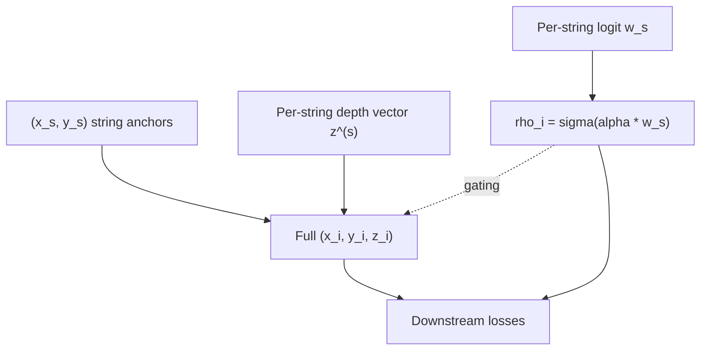
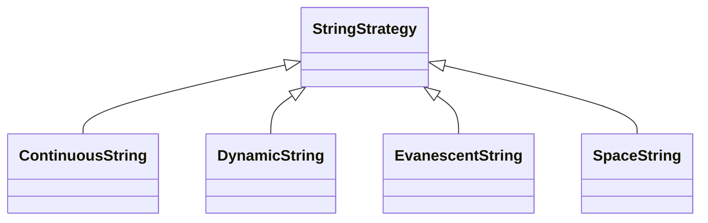

# String Parameterization

## Definition

A **string** (also *line* in KM3NeT, *mooring* in P-ONE) is a vertical
cable carrying a column of optical sensors that all share the same
surface `(x,y)` anchor and differ only in depth `z`. A string
parameterization is any reduced-dimension encoding of an `N`-DOM
detector that exploits this vertical structure:

```
(x_i, y_i, z_i)  →  (x_{s(i)}, y_{s(i)}, z_i)
```

The `S` surface positions `(x_s, y_s)` and a per-DOM depth profile
generate all `N` 3D sensor positions.

## Formal / mathematical description

Let `s : {1..N} → {1..S}` be the string-assignment map,
`M_s = |s^{-1}(s)|` the DOMs on string `s`, and
`z^{(s)} = (z^{(s)}_1, …, z^{(s)}_{M_s})` its depth vector. The full
coordinate tensor factors as

```
X_i = (x_{s(i)}, y_{s(i)}, z^{(s(i))}_{k(i)}).
```

Dimensionality: `dim(X) = 3N` (free points) vs
`dim(string encoding) = 2S + Σ_s M_s = 2S + N`. For IceCube-scale
detectors (`N ≈ 5160`, `S = 86`) this is a ~30% reduction; for
symmetry-constrained strategies it is much larger.

### Strategy families

- **[ContinuousString](../modules/geometries-ContinuousString.md)** —
  DOMs are parameterized by their arc-length position `s_i ∈ [0,1]`
  along a smooth curve `γ(s) = (0, 0, L·(s − ½))` (straight vertical) or
  a learned spline. Guarantees monotone depth ordering.
- **[DynamicString](../modules/geometries-DynamicString.md)** —
  directly learnable per-DOM depths `z_i` with an optional sort/ordering
  regularizer. `(x_s, y_s)` either fixed (hex) or learnable.
- **[EvanescentString](../modules/geometries-EvanescentString.md)** —
  adds a per-string logit `w_s`; the sigmoid `σ(w_s)` multiplies the
  per-point light yield and trigger contributions, letting the optimizer
  **softly prune** strings. A fixed tensor shape is preserved while
  `S_eff = Σ σ(w_s)` evolves continuously from e.g. 120 → 86.
- **[SpaceString](../modules/geometries-SpaceString.md)** — learns a
  small number of *spacing scalars* (ring radius, DOM pitch) over a
  fixed hex lattice. Lowest-dimensional strategy, best conditioning.

### Diagram





### String weights (evanescent gating)

For a point `i` on string `s(i)` with logit `w_{s(i)}`:

```
ρ_i = σ(α · w_{s(i)}),          α = weight_sigmoid_sharpness
```

is broadcast by
`_assign_string_weights_to_points`
([base_geometry.py L703](../../nugget/geometries/base_geometry.py#L703))
and applied multiplicatively in downstream losses
([trigger.py L70](../../nugget/losses/trigger.py#L70)). As `α → ∞`,
`ρ_i → {0,1}`, recovering a hard on/off selection from a continuous
relaxation — the same soft-to-hard idea used in
[Concrete / L0 gating](https://arxiv.org/abs/1712.01312).

## Context: why strings

Deployment physics forces strings:

- **Ice (IceCube, IceCube-Gen2):** each string requires a ~2 km hot-water
  borehole (~36 h drilling) — cost scales with `S`, not with `N`, so
  maximizing DOMs/string is natural. 86 strings × 60 DOMs.
- **Water (KM3NeT, P-ONE, Baikal-GVD):** lines are flexible, anchored
  to a seabed plate and kept vertical by top buoys; only the footprint
  `(x,y)` is freely chosen at deployment. KM3NeT: 115 lines × 18 DOMs;
  P-ONE: ~70 lines × 20 modules.

String parameterization **matches the engineering** and yields
well-conditioned gradients:

- Gradients on `(x_s, y_s)` pool contributions from all `M_s` DOMs,
  giving ≈ √M_s lower variance than free-point gradients.
- Constraints (min string spacing, max vertical extent, integer
  anchors on a seabed grid) are 2D / 1D and cheap to enforce.
- String-level weights express *build-versus-don't-build* decisions
  directly.

## Usage in `nugget`

- All four string strategies extend `Geometry`
  ([base_geometry.py L8](../../nugget/geometries/base_geometry.py#L8)).
- Grid seeds come from `create_uniform_hexagonal_grid`
  ([L47](../../nugget/geometries/base_geometry.py#L47)) and
  `create_sunflower_grid`
  ([L325](../../nugget/geometries/base_geometry.py#L325)).
- The trigger loss consumes `string_weights` via
  `map_string_weights_to_points`
  ([trigger.py L70](../../nugget/losses/trigger.py#L70)).
- Effective-area and Fisher-info losses treat every point uniformly;
  evanescent gating is the only place where string identity leaks
  into the loss value.

See strategy pages:
[ContinuousString](../modules/geometries-ContinuousString.md),
[DynamicString](../modules/geometries-DynamicString.md),
[EvanescentString](../modules/geometries-EvanescentString.md),
[SpaceString](../modules/geometries-SpaceString.md).

## Further reading

- [IceCube instrumentation paper (arXiv:1612.05093)](https://arxiv.org/abs/1612.05093)
- [KM3NeT Letter of Intent (arXiv:1601.07459)](https://arxiv.org/abs/1601.07459)
- [P-ONE — Pacific Ocean Neutrino Experiment (arXiv:2108.04310)](https://arxiv.org/abs/2108.04310)
- [Baikal-GVD progress report (arXiv:2005.09493)](https://arxiv.org/abs/2005.09493)
- [Vogel / golden-angle phyllotaxis spiral — Wikipedia](https://en.wikipedia.org/wiki/Fermat%27s_spiral#Golden_ratio_and_the_golden_angle)
- [Learning Sparse Neural Networks through L0 Regularization (arXiv:1712.01312)](https://arxiv.org/abs/1712.01312)

## See also

- [detector-geometry](detector-geometry.md)
- [hungarian-matching](hungarian-matching.md)
- [trigger](trigger.md)
- [modules/geometries](../modules/geometries.md)
