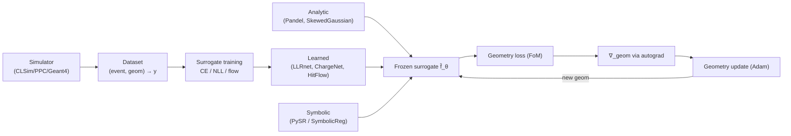

# Surrogate Modeling

## Definition

A **surrogate model** (a.k.a. emulator, response surface, metamodel) is a
cheap, differentiable function `f̂_θ(x)` trained to approximate the
input–output mapping of an expensive simulator `f(x)` — here, a
Monte-Carlo photon-propagation code (CLSim, PPC, Geant4) that maps an
event + detector geometry to per-PMT charges and photon arrival times.
Two broad families exist:

- **Physics-based / analytic surrogates** encode domain knowledge as a
  closed-form PDF (e.g. the Pandel function for Čerenkov photon
  arrival times in a scattering medium, Tamm–Frank light-yield
  expressions for tracks and cascades). Parameters (scattering/absorption
  lengths, track length) are either fixed from calibration or fitted.
- **Learned / neural surrogates** train a differentiable network
  (MLP, residual MLP, normalizing flow, neural spline) on simulator
  output. They trade interpretability for flexibility.
- **Symbolic-regression surrogates** discover compact closed-form
  approximations from data (PySR / SymbolicRegression.jl, Cranmer 2023).

## Mathematical formulation

### Objective

For a simulator `y = f(x) + ε`, the surrogate minimises the expected
loss over a training distribution `p(x)`:

```
θ* = argmin_θ  E_{x ~ p(x)} [ L( f̂_θ(x), f(x) ) ]
```

Common choices of `L`:

| Surrogate type | Target | Loss |
|---|---|---|
| Charge regressor (`ChargeNet`) | expected PE count per PMT | Poisson NLL or MSE on `log(1+q)` |
| Classifier (`LLRnet`) | signal vs. background posterior | Binary cross-entropy; outputs a calibrated log-likelihood ratio |
| Density / flow (`HitFlow`, `HitFlowNet`) | photon arrival-time PDF `p(t \| x)` | Negative log-likelihood `-Σ log p_θ(t_i\|x_i)` via change-of-variables |
| Analytic (`pandel`, `SkewedGaussian`) | `p(t \| d, τ, λ_a, λ_s)` | closed form, no training |

### Normalizing-flow surrogates

A flow expresses `p_θ(t | x)` through an invertible mapping
`t = T_θ(u; x)` from a simple base density `q(u)`:

```
log p_θ(t | x) = log q( T_θ^{-1}(t;x) ) + log |det J_{T_θ^{-1}}(t;x)|
```

nugget uses this for per-event hit-time PDFs — see
[HitFlow](../modules/surrogates-HitFlow.md),
[HitFlowNet](../modules/surrogates-HitFlowNet.md) — with
`LogTransform` keeping `t > 0`.

### Feature priors and architectures

- **`FourierFeatures`** — random Fourier basis
  `φ(x) = [cos(Bx), sin(Bx)]` (Tancik et al., NeurIPS 2020) to combat
  spectral bias on low-dim geometric inputs (string x/y, depth).
- **`ResidualBlock`** — standard pre-activation MLP residuals for
  depth without vanishing gradients.
- **`LogTransform`** — bijective `log(1+·)` wrapper composed into
  flows for heavy-tailed, non-negative targets.

### Training protocol

1. Draw a batch of `(event, geometry)` pairs from a sampler
   (see [samplers](../modules/samplers.md)).
2. Run the full simulator once per sample to get targets
   (charges / hit times / labels).
3. SGD on `L` with Adam; validate on a held-out set spanning geometry
   deformations.
4. Freeze; at optimization time only the forward pass
   (fully differentiable in geometry) is used.

## Why it matters for detector optimization

The nugget pipeline optimises neutrino-telescope string/DOM
placement by gradient descent on a figure-of-merit (usually Fisher
information or a classifier-based LLR) that is itself a function of the
detector response. The true simulator is non-differentiable and
too slow (~seconds per event) to put inside a loop with thousands of
iterations. Surrogates provide:

- **Differentiability** — gradients flow through `f̂_θ` w.r.t. geometry.
- **Speed** — milliseconds per forward pass → full-geometry batches.
- **Composition** — the same learned hit-time PDF serves both
  reconstruction (LLH) and optimization (FoM).

IceCube-Gen2 and KM3NeT studies use analogous surrogates: photon
tables (Photonics / PPC spline tables), the Pandel family for Čerenkov
timing, and modern ML replacements (Eller et al., NeurIPS ML4PS 2023;
Prado / KM3NeT). nugget follows this lineage but keeps every stage
PyTorch-differentiable.

## Diagram



## Usage in nugget

Base class and registry:

- [`Surrogate` base class](../../nugget/surrogates/base_surrogate.py) —
  common interface `forward(geom_dict, event_params) → charges | hit_times | llr`.
- [surrogates module index](../modules/surrogates.md).

Analytic:

- [LightSabre](../modules/surrogates-LightSabre.md) — Tamm-Frank / track
  and cascade Čerenkov yield, source of light used by downstream
  charge/time surrogates.
- [pandel](../modules/surrogates-pandel.md) — Pandel arrival-time PDF
  (scipy / numpy reference).
- [cpandel](../modules/surrogates-cpandel.md) — torch-differentiable
  Pandel used inside gradient loops.
- [SkewedGaussian](../modules/surrogates-SkewedGaussian.md) — closed-form
  anisotropic Gaussian for cascade light.
- [SymbolicReg](../modules/surrogates-SymbolicReg.md) — compact symbolic
  expression trained via SymbolicRegression.jl / PySR.
- [Uniform](../modules/surrogates-Uniform.md) — constant baseline for
  ablations.

Learned:

- [ChargeNet](../modules/surrogates-ChargeNet.md) — residual MLP over
  Fourier-featured geometry + event; regresses expected charges.
- [LLRnet](../modules/surrogates-LLRnet.md) — direct signal/background
  log-likelihood-ratio classifier.
- [HitFlow](../modules/surrogates-HitFlow.md),
  [HitFlowNet](../modules/surrogates-HitFlowNet.md) — normalizing flows
  (with `LogTransform`) over per-DOM hit times.

Consumers:

- [losses](../modules/losses.md) — FoM losses evaluate the surrogate
  per-iteration; see [llr](llr.md), [light-yield](light-yield.md).
- [utils-basic_optimizer](../modules/utils-basic_optimizer.md) — calls
  `surrogate.forward(geom_dict)` each step inside
  [`loss_update_step`](../../nugget/utils/basic_optimizer.py#L107).

## Further reading

- [Wikipedia — Surrogate model](https://en.wikipedia.org/wiki/Surrogate_model)
- [Wikipedia — Normalizing flow](https://en.wikipedia.org/wiki/Normalizing_flow)
- [Wikipedia — Symbolic regression](https://en.wikipedia.org/wiki/Symbolic_regression)
- [Papamakarios et al. 2021 — Normalizing Flows for Probabilistic Modeling and Inference (JMLR)](https://arxiv.org/abs/1912.02762)
- [Cranmer 2023 — Interpretable ML for Science with PySR / SymbolicRegression.jl](https://arxiv.org/abs/2305.01582)
- [Tancik et al. 2020 — Fourier Features Let Networks Learn High-Frequency Functions](https://arxiv.org/abs/2006.10739)
- [Eller et al. 2023 — A flexible event reconstruction based on machine learning for IceCube](https://arxiv.org/abs/2308.13249)

## See also

- [light-yield](light-yield.md)
- [llr](llr.md)
- [pandel-timing](pandel-timing.md)
- [alm-optimization](alm-optimization.md)
- [surrogates module](../modules/surrogates.md)
