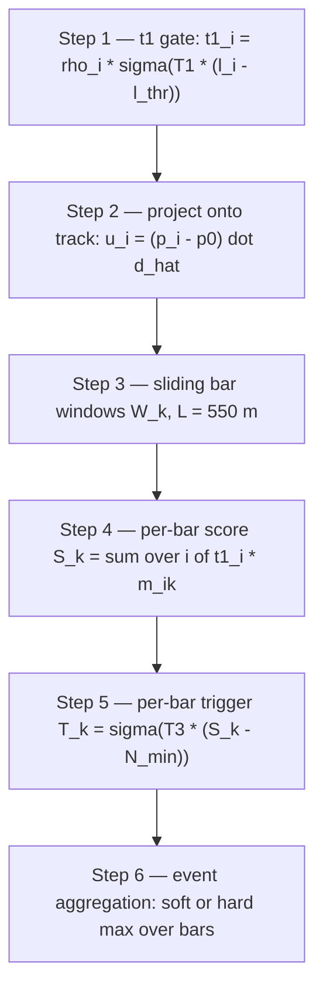

# Trigger

## Definition

A **trigger** in a particle-physics detector is an online decision rule
that accepts or rejects a readout window based on a fast, coarse summary
of the hits. In a neutrino telescope it decides, per simulated event,
whether the detector would have issued a "this is a physics event"
signal — and therefore whether the event contributes to the effective
area and the physics reach.

`nugget` models this as a **differentiable sliding-bar trigger**
(see [losses-trigger](../modules/losses-trigger.md),
[trigger.py](../../nugget/losses/trigger.py)) so it can back-propagate
through the trigger decision into the detector geometry.

## Formal / mathematical description

### Real-detector reference: simple multiplicity trigger (SMT)

IceCube's primary physics trigger is **SMT8**: issue a trigger if ≥ 8
hard-local-coincidence DOMs fire inside a 5 μs sliding window
(Aartsen et al., [arXiv:1612.05093](https://arxiv.org/abs/1612.05093)).
KM3NeT uses an analogous L1/L2 local-coincidence + clustering rule
([arXiv:1601.07459](https://arxiv.org/abs/1601.07459)). The common
structure is

```
trigger = [ Σ_i 1{hit_i in window}  ≥  N_thr ]   for some sliding window.
```

The step functions are not differentiable, so a surrogate is needed for
geometry gradients.

### `nugget` sliding-bar surrogate

For each simulated event with track direction `d̂` and points `p_i` with
light yield `ℓ_i` and string weight `ρ_i`:

1. **Point-detection probability (t1).** A smooth hit indicator

   ```
   t1_i = ρ_i · σ( T1 · (ℓ_i − ℓ_thr) )
   ```

   with `T1 = t1_temperature`,
   `ℓ_thr = light_yield_threshold` (default 6.0 p.e.).
   [trigger.py L5](../../nugget/losses/trigger.py#L5)

2. **Projection.** Project each point on the track:
   `u_i = (p_i − p_0) · d̂`.

3. **Sliding bar.** For bar center `c_k` and length
   `L = distance_bar_length = 550 m`
   ([trigger.py L39](../../nugget/losses/trigger.py#L39)),
   bar window `W_k = [c_k − L/2, c_k + L/2]`. Inside-window indicator

   ```
   m_{ik} = σ( T · (u_i − c_k + L/2) ) · σ( T · (c_k + L/2 − u_i) ).
   ```

4. **Per-bar score.** Soft multiplicity

   ```
   S_k = Σ_i t1_i · m_{ik}.
   ```

5. **Per-bar trigger (t3).**

   ```
   T_k = σ( T3 · (S_k − N_min) ),   N_min = min_points_threshold = 30.
   ```

6. **Event aggregation.** Either soft-max over bars

   ```
   trigger_per_event = Σ_k  softmax_k(T_temperature · T_k) · T_k,
   ```

   or hard max when `use_hard_cuts=True`.

### Diagram



### Relation to SMT

At high temperatures `T1, T3, T → ∞` and with `ρ_i ≡ 1`, the surrogate
converges to "at least `N_min` DOMs fire in a 550 m sliding window along
the track" — the geometry-optimization analogue of SMT*N*, but along
the track projection instead of a wall-clock window. The 550 m bar is
roughly the speed-of-light crossing time of a typical IceCube trigger
window projected on the track.

## Context

A loss that ignores trigger efficiency over-invests in pathological
regions of geometry space where individual DOMs gather tremendous
light on a few tracks but the event never actually triggers. Every
DOM that contributes to the Fisher information must also contribute
to triggering, which is a joint-coverage requirement very different
from per-point light yield. A smooth surrogate is mandatory:

- **Discontinuity.** A step-function trigger produces zero gradients
  almost everywhere — useless for gradient-based optimization.
- **Counterfactual symmetry.** The sigmoids are tuned so that
  `trigger_per_event ≈ 0.5` at the real-detector decision boundary,
  giving meaningful gradients to geometries that are near-triggering.
- **String pruning.** The `ρ_i` factor couples evanescent
  [string weights](string-parameterization.md) into the trigger,
  so the optimizer pays for building a string only if it helps cross
  the trigger threshold on enough events.

## Usage in `nugget`

- Main implementation:
  [losses-trigger](../modules/losses-trigger.md) /
  [trigger.py](../../nugget/losses/trigger.py),
  `TriggerLoss` at
  [L5](../../nugget/losses/trigger.py#L5),
  `map_string_weights_to_points` at
  [L70](../../nugget/losses/trigger.py#L70).
- Legacy pairwise-distance version:
  [losses-trigger_old](../modules/losses-trigger_old.md)
  / [trigger_old.py](../../nugget/losses/trigger_old.py) — deprecated;
  retained for reproducing older results.
- Consumed alongside
  [losses-effective_area](../modules/losses-effective_area.md) — the
  effective-area integrand is weighted by `trigger_per_event`.
- Depends on a light-yield estimator upstream (see
  [light-yield](light-yield.md)).

Key knobs: `light_yield_threshold`, `distance_bar_length`,
`distance_bar_step`, `min_points_threshold`, `t1_temperature`,
`t3_temperature`, `t_temperature`, `use_hard_cuts`,
`weight_sigmoid_sharpness`.

## Further reading

- [Trigger (particle physics) — Wikipedia](https://en.wikipedia.org/wiki/Trigger_(particle_physics))
- [The IceCube Neutrino Observatory: Instrumentation and Online Systems (arXiv:1612.05093)](https://arxiv.org/abs/1612.05093) — SMT8 and the IceCube trigger hierarchy.
- [Energy Reconstruction Methods in the IceCube Neutrino Telescope (arXiv:1311.4767)](https://arxiv.org/abs/1311.4767)
- [KM3NeT Letter of Intent (arXiv:1601.07459)](https://arxiv.org/abs/1601.07459) — L1/L2 coincidence triggers in seawater.
- [The IceCube DAQ — Kirchgessner, ICRC (2011)](https://arxiv.org/abs/1111.2741)

## See also

- [detector-geometry](detector-geometry.md)
- [string-parameterization](string-parameterization.md)
- [light-yield](light-yield.md)
- [effective-area](effective-area.md)
- [modules/losses-trigger](../modules/losses-trigger.md)
