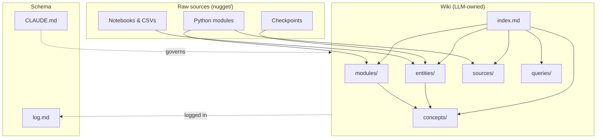

# Wiki Index

Content-oriented catalog. See [CLAUDE.md](CLAUDE.md) for the schema
and [log.md](log.md) for the chronological record.

## Architecture

## Modules

### Package overviews
- [geometries](modules/geometries.md), [losses](modules/losses.md),
  [surrogates](modules/surrogates.md), [samplers](modules/samplers.md),
  [utils](modules/utils.md), [examples](modules/examples.md),
  [other](modules/other.md)

### geometries/
- [base_geometry](modules/geometries-base_geometry.md)
- [ContinuousString](modules/geometries-ContinuousString.md)
- [DynamicString](modules/geometries-DynamicString.md)
- [EvanescentString](modules/geometries-EvanescentString.md)
- [FreePoints](modules/geometries-FreePoints.md)
- [SpaceString](modules/geometries-SpaceString.md)

### losses/
- [base_loss](modules/losses-base_loss.md), [LLR](modules/losses-LLR.md),
  [SNR](modules/losses-SNR.md), [RBF](modules/losses-RBF.md),
  [light_yield](modules/losses-light_yield.md),
  [effective_area](modules/losses-effective_area.md),
  [fisher_info](modules/losses-fisher_info.md),
  [geometry_penalties](modules/losses-geometry_penalties.md),
  [pointsource_fom](modules/losses-pointsource_fom.md),
  [trigger](modules/losses-trigger.md),
  [trigger_old](modules/losses-trigger_old.md) *(deprecated)*

### surrogates/
- [base_surrogate](modules/surrogates-base_surrogate.md),
  [ChargeNet](modules/surrogates-ChargeNet.md),
  [HitFlow](modules/surrogates-HitFlow.md),
  [HitFlowNet](modules/surrogates-HitFlowNet.md),
  [LLRnet](modules/surrogates-LLRnet.md),
  [LightSabre](modules/surrogates-LightSabre.md),
  [SkewedGaussian](modules/surrogates-SkewedGaussian.md),
  [SymbolicReg](modules/surrogates-SymbolicReg.md),
  [Uniform](modules/surrogates-Uniform.md),
  [pandel](modules/surrogates-pandel.md),
  [cpandel](modules/surrogates-cpandel.md),
  [old_LLRnet](modules/surrogates-old_LLRnet.md) *(deprecated)*

### samplers/
- [base_sampler](modules/samplers-base_sampler.md),
  [toy_sampler](modules/samplers-toy_sampler.md),
  [cyl_sampler](modules/samplers-cyl_sampler.md)

### utils/
- [__init__](modules/utils-__init__.md),
  [basic_evaluator](modules/utils-basic_evaluator.md),
  [basic_optimizer](modules/utils-basic_optimizer.md),
  [schedulers](modules/utils-schedulers.md),
  [vis_tools](modules/utils-vis_tools.md)

## Concepts
- [llr](concepts/llr.md)
- [fisher-information](concepts/fisher-information.md)
- [light-yield](concepts/light-yield.md)
- [pandel-timing](concepts/pandel-timing.md)
- [effective-area](concepts/effective-area.md)
- [trigger](concepts/trigger.md)
- [figure-of-merit](concepts/figure-of-merit.md)
- [detector-geometry](concepts/detector-geometry.md)
- [string-parameterization](concepts/string-parameterization.md)
- [hungarian-matching](concepts/hungarian-matching.md)
- [surrogate-modeling](concepts/surrogate-modeling.md)
- [alm-optimization](concepts/alm-optimization.md)

## Entities

### Geometry presets (`other/`)
- [geom-340grid](entities/geom-340grid.md) — base hex grid (341 pts)
- [geom-102geom](entities/geom-102geom.md), [geom-160geom](entities/geom-160geom.md)
- 75-pt variants: [compact](entities/geom-compact.md), [default](entities/geom-default.md),
  [donut](entities/geom-donut.md), [donut2](entities/geom-donut2.md),
  [expanded](entities/geom-expanded.md), [large](entities/geom-large.md),
  [modified](entities/geom-modified.md)

### Notebooks (`other/`)
- [notebook-grid-maker-visualizer-csvwriter](entities/notebook-grid-maker-visualizer-csvwriter.md)
- [notebook-water-model](entities/notebook-water-model.md)

### Examples (`examples/`)
- Training: [train_chargenet](entities/example-train_chargenet.md),
  [train_hitflow](entities/example-train_hitflow.md),
  [train_hitflownet](entities/example-train_hitflownet.md),
  [train_signal_only_llr](entities/example-train_signal_only_llr.md),
  [train_signal_only_llr_patd](entities/example-train_signal_only_llr_patd.md)
- Data/optimization: [make_data_signal_only_llr_patd](entities/example-make_data_signal_only_llr_patd.md),
  [dynamic_strings_test](entities/example-dynamic_strings_test.md),
  [uniform_rov_alm_test](entities/example-uniform_rov_alm_test.md),
  [res_test](entities/example-res_test.md),
  [res_test_make_geoms](entities/example-res_test_make_geoms.md)
- Utilities: [threads_prep.sh](entities/example-threads_prep.sh.md)
- Notebooks: [example_notebook](entities/example-example_notebook.md),
  [dynamic_strings_test.ipynb](entities/example-dynamic_strings_test.ipynb.md),
  [loss_landscape_test.ipynb](entities/example-loss_landscape_test.ipynb.md),
  [test_evaluation.ipynb](entities/example-test_evaluation.ipynb.md),
  [rov_evaluation.ipynb](entities/example-rov_evaluation.ipynb.md),
  [test_NSF_patd.ipynb](entities/example-test_NSF_patd.ipynb.md)

## Sources
- [readme](sources/readme.md), [setup-py](sources/setup-py.md),
  [requirements](sources/requirements.md), [license](sources/license.md),
  [package-init](sources/package-init.md)

## Queries
*None yet.*
