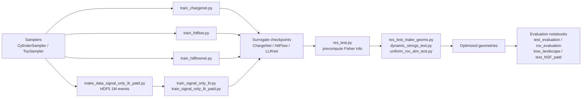

# examples module

## Overview
The examples module contains standalone Python scripts and Jupyter notebooks demonstrating key workflows in the NUGGET project: training surrogate models (ChargeNet, LLRnet, HitFlow), preprocessing datasets, optimizing detector geometries, and evaluating physics performance.

## Workflow



## Scripts

### Surrogate Model Training

**[train_chargenet.py](../entities/example-train_chargenet.md)**
Trains ChargeNet (charge response surrogate) using multi-branch Fourier feature architecture. Produces best_charge_net_model checkpoint and training history.

**[train_hitflow.py](../entities/example-train_hitflow.md)**
Trains HitFlow normalizing flow model for photon arrival time distributions (PATD). Uses LightSabrePATD surrogate with Poisson statistics. Outputs best_hitflow_model_v4.

**[train_hitflownet.py](../entities/example-train_hitflownet.md)**
Pregenerates HitFlowNet training dataset by fitting individual normalizing flows to each event. Saves per-event flow parameters for downstream meta-network training.

**[train_signal_only_llr.py](../entities/example-train_signal_only_llr.md)**
Trains LLRnet on cascade events without PATD features. Single-branch 6-layer MLP architecture. Produces best_cascade_charge_llr_model_v1.

**[train_signal_only_llr_patd.py](../entities/example-train_signal_only_llr_patd.md)**
Trains LLRnet with per-photon PATD timing features. Deeper 7-layer architecture with dynamic photon sampling. Outputs best_hit_llr_model_v3.

### Dataset Preparation

**[make_data_signal_only_llr_patd.py](../entities/example-make_data_signal_only_llr_patd.md)**
Pregenerates 1 million signal events with PATD features to HDF5 file (1e6_200_patd_dataset.h5) for efficient training.

### Detector Optimization

**[dynamic_strings_test.py](../entities/example-dynamic_strings_test.md)**
Optimizes DynamicString geometry (70 strings, variable XY positions) to maximize angular resolution under ROV and geometric constraints. Saves optimized geometry checkpoints.

**[uniform_rov_alm_test.py](../entities/example-uniform_rov_alm_test.md)**
Tests Augmented Lagrangian Method (ALM) constraint solver using toy uniform light yield surrogate. Validates ALM dynamics before production optimization runs.

### Physics Evaluation

**[res_test.py](../entities/example-res_test.md)**
Computes precomputed Fisher information and light yield tensors for multiple geometries. Supports efficient geometry optimization by caching expensive Fisher info calculations.

**[res_test_make_geoms.py](../entities/example-res_test_make_geoms.md)**
Runs 15 independent geometry optimizations using precomputed Fisher info. Maximizes angular resolution under ROV constraints. Outputs 15 optimized geometry checkpoints.

### Utilities

**[threads_prep.sh](../entities/example-threads_prep.sh.md)**
Configures OpenMP/MKL threading (OMP_NUM_THREADS=1, MKL_NUM_THREADS=1, OPENBLAS_NUM_THREADS=1) for reproducible parallel training with PyTorch DataLoader.

## Notebooks

### Interactive Tutorials

**[example_notebook.ipynb](../entities/example-example_notebook.md)**
Complete end-to-end tutorial: toy light yield surrogate → LLRnet training → geometry optimization → visualization. Recommended starting point for new users.

**[dynamic_strings_test.ipynb](../entities/example-dynamic_strings_test.ipynb.md)**
Interactive DynamicString optimization with real-time visualization. Two-phase optimization: string XY positions then individual detector z-positions.

### Physics Analysis

**[loss_landscape_test.ipynb](../entities/example-loss_landscape_test.ipynb.md)**
Systematic parameter sweep: 30x30 grid of detector spacings with computation of light yield, angular resolution, energy resolution, ROV penalty, trigger efficiency. Generates comprehensive loss landscape visualization.

**[test_evaluation.ipynb](../entities/example-test_evaluation.ipynb.md)**
Evaluates optimized geometries using precomputed Fisher information. Computes angular resolution and point-source FOM vs. energy and zenith angle. Compares multiple geometry variants.

**[rov_evaluation.ipynb](../entities/example-rov_evaluation.ipynb.md)**
Analyzes ROV physical constraints across geometry variants. Visualizes per-string ROV penalty violations. Computes active string counts, spacing statistics, and center-of-mass properties.

### Advanced Techniques

**[test_NSF_patd.ipynb](../entities/example-test_NSF_patd.ipynb.md)**
Custom normalizing flow training for PATD modeling. Demonstrates conditional likelihood computation, 2D energy-zenith parameter scans, and comparison with HitFlow surrogate. Includes photon-level feature engineering and multi-layer flow architecture.

## Workflow Diagram

```
Dataset                     Models                     Evaluation
────────────────────────────────────────────────────────────────

Signal Events (Sampler)
  ↓
  ├→ train_signal_only_llr*.py ──→ LLRnet (best_hit_llr_model_v3)
  ├→ train_chargenet.py ─────────→ ChargeNet
  ├→ train_hitflow.py ───────────→ HitFlow
  └→ make_data_signal_only_llr_patd.py ──→ HDF5 Dataset (1M events)

Geometry
  ├→ dynamic_strings_test.py ──────→ Optimized DynamicString
  ├→ res_test.py ──────────────────→ Fisher Info (precomputed)
  └→ res_test_make_geoms.py ─→ 15x Optimized EvanescentString

Evaluation
  ├→ test_evaluation.ipynb ─────→ Angular resolution vs. energy
  ├→ rov_evaluation.ipynb ──────→ ROV constraint violations
  ├→ loss_landscape_test.ipynb ─→ Physics landscape sweep
  └→ test_NSF_patd.ipynb ───────→ PATD likelihood inference
```

## Quick Start

1. **Train a simple surrogate**:
   ```bash
   source threads_prep.sh
   python train_chargenet.py
   ```

2. **Explore full workflow** (recommended):
   ```bash
   jupyter notebook example_notebook.ipynb
   ```

3. **Optimize geometry**:
   ```bash
   python res_test.py              # Precompute Fisher info
   python res_test_make_geoms.py   # Optimize geometries
   jupyter notebook test_evaluation.ipynb  # Analyze results
   ```

4. **Test PATD likelihood inference**:
   ```bash
   jupyter notebook test_NSF_patd.ipynb
   ```

## Related Modules
- [surrogates](../modules/surrogates.md): ChargeNet, LLRnet, HitFlow, HitFlowNet models
- [samplers](../modules/samplers.md): CylinderSampler, ToySampler for event generation
- [geometries](../modules/geometries.md): EvanescentString, DynamicString detector layouts
- [losses](../modules/losses.md): Fisher information, ROV penalty, trigger efficiency
- [utils](../modules/utils.md): Optimizer, Visualizer, Evaluator for training and evaluation

## See also
- [surrogates module](../modules/surrogates.md): Core surrogate implementations
- [losses module](../modules/losses.md): Physics loss function implementations
- [Project README](../../README.md): High-level project overview
