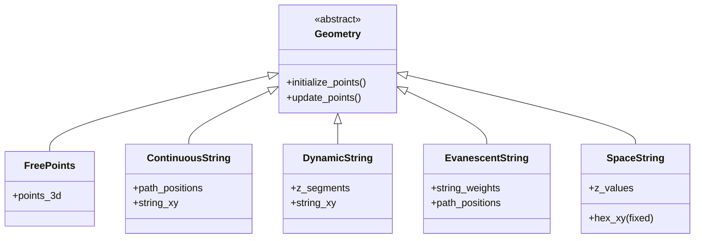

# geometries

Framework for point-distribution strategies in 3D space. All classes
inherit from `Geometry` and follow a two-phase contract:
`initialize_points()` then `update_points()` for gradient-based
optimization of detector layout.

## Architecture



## Strategies

| Strategy | File | Use case |
|---|---|---|
| Base | [base_geometry](geometries-base_geometry.md) | grid utilities + Hungarian matching |
| Free points | [FreePoints](geometries-FreePoints.md) | unconstrained |
| Continuous | [ContinuousString](geometries-ContinuousString.md) | 1D path → 3D strings |
| Dynamic | [DynamicString](geometries-DynamicString.md) | discrete z-segments |
| Evanescent | [EvanescentString](geometries-EvanescentString.md) | learnable weights gate strings |
| Space | [SpaceString](geometries-SpaceString.md) | fixed hex XY, learnable z |

## Common output dict

```python
{
  'points_3d': Tensor (N, 3),
  'string_xy': Tensor (S, 2),
  'z_values': Tensor (N,),
  'string_indices': list/Tensor,
  'points_per_string_list': list,
  # strategy-specific: weights, path_positions, spacing, ...
}
```

## Grid layouts ([base_geometry.py](../../nugget/geometries/base_geometry.py))

- Hexagonal rings — [L47](../../nugget/geometries/base_geometry.py#L47)
- Circular hexagonal — [L207](../../nugget/geometries/base_geometry.py#L207)
- Sunflower (golden angle) — [L325](../../nugget/geometries/base_geometry.py#L325)
- Hybrid hex/sunflower via Hungarian — [L373](../../nugget/geometries/base_geometry.py#L373)

## Dependencies

`torch`, `numpy`, `scipy.optimize.linear_sum_assignment`.

## See also

- [samplers](samplers.md), [losses](losses.md), [utils](utils.md)
