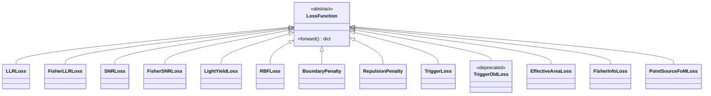

# losses

Optimization loss functions for detector-geometry refinement. Each
class inherits `LossFunction` and returns a dict with a key ending in
`_loss` (scalar) plus auxiliary metrics.

## Architecture

Groupings: LLR family (`LLRLoss`, `FisherLLRLoss`), SNR family
(`SNRLoss`, `FisherSNRLoss`), light-yield (`LightYieldLoss`, `RBFLoss`),
geometry penalties (`BoundaryPenalty`, `RepulsionPenalty`), trigger
(`TriggerLoss`, deprecated `TriggerOldLoss`), effective-area, Fisher,
FoM.

## Pages

- [base_loss](losses-base_loss.md) — abstract base
- [LLR](losses-LLR.md) — log-likelihood-ratio discrimination
- [SNR](losses-SNR.md) — signal-to-noise ratio
- [RBF](losses-RBF.md) — RBF interpolation fidelity
- [light_yield](losses-light_yield.md) — photon yield maximization
- [effective_area](losses-effective_area.md) — muon track acceptance
- [fisher_info](losses-fisher_info.md) — Fisher-based resolution
- [geometry_penalties](losses-geometry_penalties.md) — boundary + repulsion
- [pointsource_fom](losses-pointsource_fom.md) — A_eff × resolution FoM
- [trigger](losses-trigger.md) — sliding-bar trigger efficiency
- [trigger_old](losses-trigger_old.md) — legacy pairwise trigger (deprecated)

## See also

- [geometries](geometries.md), [surrogates](surrogates.md), [samplers](samplers.md), [utils](utils.md)
