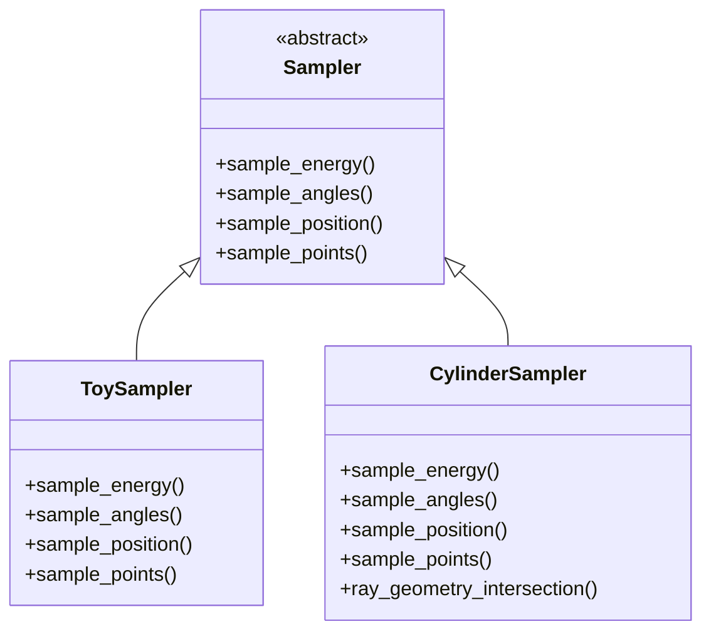

# samplers

Samplers generate neutrino events and detector points from configurable
probability distributions. A base abstract class defines the interface;
concrete implementations cover a toy model and a cylindrical detector.

## Class hierarchy

## Purpose

- Energy sampling (power-law, log-uniform)
- Angular sampling (zenith, azimuth)
- Position sampling (uniform or geometry-aware)
- Detector point sampling inside a domain

## Module structure

| File | Purpose |
|------|---------|
| [base_sampler.py](../../nugget/samplers/base_sampler.py) | Abstract base class and interface |
| [toy_sampler.py](../../nugget/samplers/toy_sampler.py) | Simple toy implementation |
| [cyl_sampler.py](../../nugget/samplers/cyl_sampler.py) | Cylindrical detector sampler with ray-geometry intersection |
| [__init__.py](../../nugget/samplers/__init__.py) | Module imports |

## Key classes

- `Sampler` — [base_sampler.py:3](../../nugget/samplers/base_sampler.py#L3)
- `ToySampler` — [toy_sampler.py:6](../../nugget/samplers/toy_sampler.py#L6)
- `CylinderSampler` — [cyl_sampler.py:450](../../nugget/samplers/cyl_sampler.py#L450)

## Dependencies

`torch`, `numpy`, stdlib `math`.

## See also

- [samplers-base_sampler](samplers-base_sampler.md)
- [samplers-toy_sampler](samplers-toy_sampler.md)
- [samplers-cyl_sampler](samplers-cyl_sampler.md)
- [surrogates](surrogates.md)
- [geometries](geometries.md)
