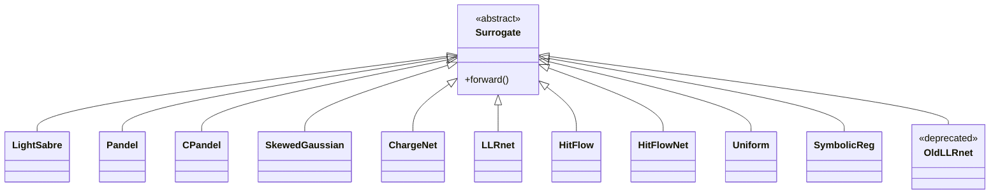
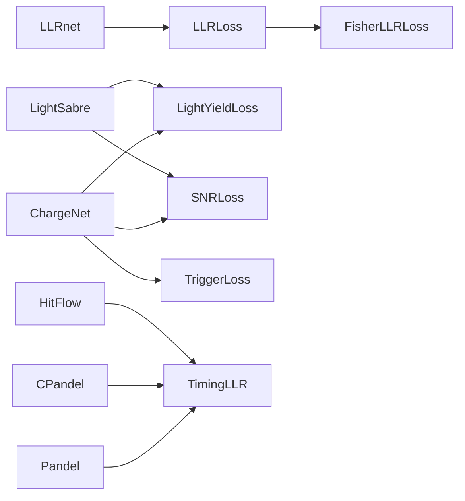

# surrogates

Surrogate models for detector response — physics-based analytic forms
and learned neural networks. All derive from `Surrogate`
([base_surrogate.py](../../nugget/surrogates/base_surrogate.py)).

## Architecture

Groups: **Physics** (LightSabre, Pandel, CPandel, SkewedGaussian),
**Learned** (ChargeNet, LLRnet, HitFlow, HitFlowNet), **Utility** (Uniform,
SymbolicReg, old_LLRnet).

### Surrogate → Loss flow

## Physics-based
- [LightSabre](surrogates-LightSabre.md) — Cherenkov yield (track/cascade).
- [pandel](surrogates-pandel.md) — Pandel photon arrival-time PDF (scipy).
- [cpandel](surrogates-cpandel.md) — torch-differentiable Pandel.
- [SkewedGaussian](surrogates-SkewedGaussian.md) — anisotropic Gaussian.

## Learned
- [ChargeNet](surrogates-ChargeNet.md) — regression MLP for charge/yield.
- [LLRnet](surrogates-LLRnet.md) — binary signal/background classifier.
- [HitFlow](surrogates-HitFlow.md) — normalizing flow on hit times (PATD).
- [HitFlowNet](surrogates-HitFlowNet.md) — hybrid flow+MLP.

## Utility / legacy
- [Uniform](surrogates-Uniform.md) — constant baseline.
- [SymbolicReg](surrogates-SymbolicReg.md) — Julia-derived symbolic amplitude.
- [old_LLRnet](surrogates-old_LLRnet.md) — **deprecated.**

## Shared infra
- `FourierFeatures` (ChargeNet, LLRnet, HitFlowNet, old_LLRnet).
- `ResidualBlock` (ChargeNet).
- `LogTransform` (HitFlow, HitFlowNet).

## See also
- [losses](losses.md), [samplers](samplers.md), [geometries](geometries.md)
