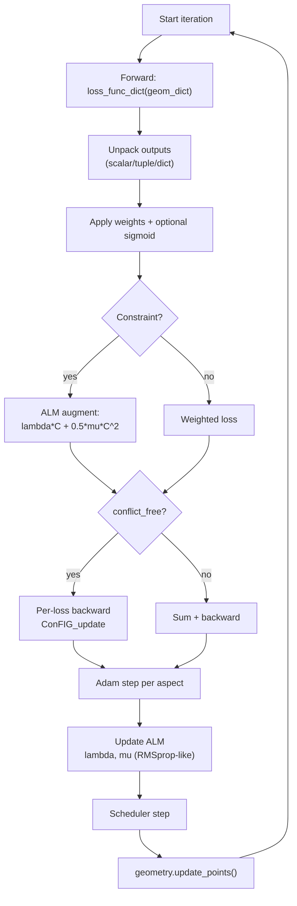

# basic_optimizer.py

## Pipeline

## Purpose

Implements a gradient-based geometry optimizer supporting multi-loss weighted optimization, conflict-free gradient descent, and augmented Lagrangian methods (ALM) for constrained optimization. The `Optimizer` class orchestrates loss computation, backpropagation, parameter updates, learning rate scheduling, and optional visualization during iterative refinement.

## Key Classes/Functions

### Optimizer

[`Optimizer`](../../nugget/utils/basic_optimizer.py#L10) — Main optimizer class.

**Methods:**

- [`__init__(device, geometry, visualizer, conflict_free, use_custom_cf_weight, use_alm, alm_params, sigmoid_losses, sigmoid_softness)`](../../nugget/utils/basic_optimizer.py#L12) — Initialize optimizer.
  - **conflict_free**: Enable conflict-free gradient descent (ConFIG).
  - **use_alm**: Enable augmented Lagrangian method for constraints.
  - **alm_params**: Dict with ALM hyperparameters (gamma, alpha, epsilon, lambda/mu bounds).
  - **sigmoid_losses**: Apply sigmoid(softness × weighted_loss) - 0.5 to losses.

- [`init_geometry(opt_list, schedule_creator, schedule_params, geom_dict)`](../../nugget/utils/basic_optimizer.py#L42) — Initialize geometry and per-aspect optimizers.
  - **opt_list**: List of (aspect_name, learning_rate) tuples (e.g., [('string_xy', 0.01)]).
  - Creates Adam optimizer for each optimizable aspect.
  - Optionally creates learning rate schedulers.

- [`_initialize_alm_parameters()`](../../nugget/utils/basic_optimizer.py#L61) — Initialize ALM Lagrange multipliers (λ) and penalty parameters (μ).

- [`_update_alm_parameters()`](../../nugget/utils/basic_optimizer.py#L76) — Update ALM parameters after each parameter update using RMSprop-like moving averages.

- [`loss_update_step()`](../../nugget/utils/basic_optimizer.py#L107) — Perform one backward pass and parameter update.
  - Handles both conflict-free and standard gradient descent.
  - Applies ALM augmentation when constraints are active.
  - Respects alternate_freq for staggered optimizer phases.

- [`optimize(loss_func_dict, loss_dict, uw_loss_dict, loss_weights_dict, loss_params_dict, n_iter, print_freq, vis_freq, gif_freq, **kwargs)`](../../nugget/utils/basic_optimizer.py#L222) — Main optimization loop.
  - **loss_func_dict**: Mapping loss_name → callable(geom_dict, **loss_params_dict).
  - **loss_weights_dict**: Per-loss scaling weights.
  - **loss_params_dict**: Shared kwargs for all loss functions (e.g., samplers, event params).
  - **n_iter**: Number of iterations.
  - **print_freq, vis_freq, gif_freq**: Control logging and visualization frequency.
  - **kwargs**: Optional save_geom_folder, alternate_freq, constraints_list, sigmoid_loss_list.
  - Returns: final geom_dict.

- [`_snapshot_geom_dict()`](../../nugget/utils/basic_optimizer.py#L208) — Serialize geometry (detach tensors, move to CPU) for pickling.

### CustomWeight

[`CustomWeight(WeightModel)`](../../nugget/utils/basic_optimizer.py#L440) — Conflict-free weight model.

- [`get_weights(gradients, losses, device)`](../../nugget/utils/basic_optimizer.py#L452) — Compute per-loss weights for conflict-free aggregation; respects `weights_dict`.

## Optimization Pipeline

1. **Geometry initialization**: Construct optimizable parameters (string_xy, etc.) with per-aspect learning rates.
2. **ALM setup** (if enabled): Initialize Lagrange multipliers and penalty parameters for constraint losses.
3. **Per-iteration loop**:
   - Reset gradient accumulators.
   - Compute each loss function and normalize output (dict/tuple/scalar).
   - Apply weighting, sigmoid saturation (optional), ALM augmentation (if constraint).
   - Compute backward pass (may retain graph for multi-loss gradients).
   - **Conflict-free path** (if enabled): Aggregate gradients per-aspect, apply ConFIG to find conflict-free direction.
   - **Standard path**: Sum weighted losses and backprop directly.
   - Update parameters via Adam.
   - Update ALM parameters (λ, μ) after parameter step.
   - Step learning rate schedulers.
   - Refresh geometry via `update_points()`.
4. **Checkpointing** (if enabled): Save intermediate geom dicts at regular intervals.
5. **Visualization** (optional): Render progress at specified frequencies; generate GIFs.
6. **Return**: Final optimized geometry.

**Key invariant**: Weighted losses and unweighted (raw) losses are tracked separately for analysis and visualization.

## Dependencies

- `torch` — tensor ops, Adam optimizer, gradient computation.
- `numpy` — numerical operations.
- `conflictfree.grad_operator` — ConFIG_update for conflict-free aggregation.
- `conflictfree.weight_model` — WeightModel, EqualWeight for multi-objective weighting.
- `pickle, os, re` — geometry serialization and file I/O.
- Implicit: `geometry` object (expects `initialize_points()`, `update_points()`).
- Implicit: `visualizer` object (expects `visualize_progress()`).

## Notes

- **Conflict-free gradients**: When enabled, independently computes gradients for each loss, then aggregates them into a Pareto-optimal direction that respects per-loss weights.
- **ALM augmentation**: Constraint losses are replaced by λC(θ) + (1/2)μC(θ)² during backward pass; λ and μ are updated adaptively post-step.
- **Sigmoid saturation**: Optional smooth clipping of loss values to (-0.5, 0.5) range before weighting, useful for stability.
- **Alternate frequencies**: Can stagger optimizer phases (e.g., optimize string_xy every N steps, other aspects every step).
- **Geometry checkpointing**: Intermediate geometries saved as pickles for recovery or ensemble methods.
- **Event resampling**: If `signal_sampler` present in loss_params_dict and `sample_every` > 0, events are regenerated at specified intervals.

## See also

- [[utils-basic_evaluator]] — paired evaluator for no-gradient assessment
- [[utils-schedulers]] — learning rate scheduling strategies
- [[utils-vis_tools]] — visualization backend
- [[concepts-conflictfree]] — conflict-free gradient descent theory
- [[concepts-alm]] — augmented Lagrangian methods
- [[concepts-losses]] — loss function design

