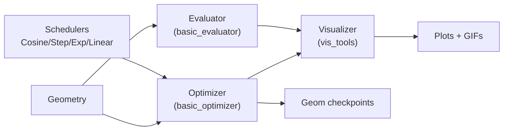

# utils

## Architecture



## Purpose

Core utilities for the nugget optimization framework. Provides gradient-based and no-gradient evaluation/optimization, learning rate scheduling, and comprehensive visualization of detector geometries and optimization progress.

## Module Overview

The `nugget.utils` package contains five key submodules:

### [[utils-__init__]] — Package initialization
Exposes all submodules for convenient access.

### [[utils-basic_optimizer]] — Gradient-based optimizer (222 lines)
**Optimizer** class orchestrating multi-loss weighted optimization with support for:
- Conflict-free gradient descent (ConFIG) for Pareto-optimal multi-objective optimization.
- Augmented Lagrangian methods (ALM) for constrained optimization.
- Optional sigmoid loss saturation for numerical stability.
- Alternate optimization phases for staged parameter updates.
- Intermediate geometry checkpointing and event resampling.

Key methods: `init_geometry()`, `optimize()`, `loss_update_step()`, `_snapshot_geom_dict()`.

### [[utils-basic_evaluator]] — No-gradient evaluator (311 lines)
**Evaluator** class for single-shot loss assessment:
- Single-geometry `evaluate()` and multi-geometry `evaluate_multi()` methods.
- Flexible loss output unpacking (scalar/tuple/list/dict).
- Multi-geometry validation and dict-reuse bug detection.
- Optional visualization and geometry point updates.

Key methods: `evaluate()`, `evaluate_multi()`, `_unpack_loss_output()`.

### [[utils-schedulers]] — Learning rate scheduling (404 lines)
Scheduler base class and four concrete implementations:
- **CosineScheduler**: Cosine annealing with warm/cool phases.
- **StepScheduler**: Piecewise constant decay at fixed intervals.
- **ExponentialScheduler**: Per-iteration multiplicative decay.
- **LinearScheduler**: Linear interpolation to end factor.

Factory function `create_scheduler()` for easy instantiation.

### [[utils-vis_tools]] — Visualization toolkit (~8000 lines)
**Visualizer** class with 50+ plot types:
- **Geometry plots**: 3D points, string XY, Z distribution, string distribution.
- **Loss tracking**: Weighted/unweighted loss history, loss components.
- **Physics metrics**: SNR, LLR, Fisher information, angular/energy resolution, point-source FOM.
- **LLR contours**: Signal/background LLR heatmaps, histograms.
- **Surrogates**: True function, interpolated, error, surrogate model comparisons.
- **ALM tracking**: Lagrange multiplier and penalty parameter history.
- **GIF generation**: Animated optimization runs with frame padding.
- **Coordinate conversions**: Spherical ↔ Cartesian for angular projections.

Methods: `visualize_progress()`, `visualize_multi_progress()`, utility functions for FOM computation and confidence intervals.

## Optimization Pipeline (Conceptual)

```
1. User defines:
   - Geometry (e.g., detector string layout)
   - Loss functions (e.g., LLR, angular resolution)
   - Optimization parameters (learning rates, schedules, ALM)
   - Visualization preferences (plot types, frequencies)

2. Create optimizer:
   opt = Optimizer(device, geometry, visualizer, ...)
   opt.init_geometry(opt_list=[('string_xy', lr)], ...)

3. Run optimization:
   final_geom = opt.optimize(
       loss_func_dict={...},
       loss_weights_dict={...},
       loss_params_dict={...},
       n_iter=1000,
       vis_freq=50,
       ...
   )

4. Inside optimize loop (per iteration):
   a. Compute each loss function
   b. Unpack outputs (standardize formats)
   c. Apply weighting, sigmoid, ALM augmentation
   d. Backward pass (conflict-free or standard)
   e. Update parameters (Adam)
   f. Update ALM parameters if enabled
   g. Step learning rate scheduler
   h. Update geometry via geometry.update_points()
   i. Visualize (optional)

5. Post-optimization:
   evaluator = Evaluator(device, geometry, visualizer)
   results = evaluator.evaluate_multi(geom_dicts, loss_func_dicts, ...)
```

## Key Concepts

### Multi-Objective Optimization
- **Weighted sum**: Each loss weighted by `loss_weights_dict[name]`.
- **Conflict-free gradients**: When enabled, ConFIG aggregates per-loss gradients into Pareto-optimal direction.

### Constrained Optimization (ALM)
- Constraint losses listed in `constraints_list`.
- Augmented loss: λC(θ) + (1/2)μC(θ)²; λ and μ updated adaptively post-step.
- Useful for hard constraints (e.g., budget, volume) on geometry design.

### Loss Output Flexibility
- Loss functions return scalar, tuple, list, or dict.
- `_unpack_loss_output()` normalizes to (value, extra_kwargs) for uniform handling.

### Geometry Interface
- Optimizer and Evaluator expect geometry object with:
  - `initialize_points(initial_geometry=geom_dict)` → geom_dict
  - `update_points(**geom_dict)` → geom_dict (refreshes derived properties)

### Visualizer Integration
- Optimizer/Evaluator call visualizer with comprehensive kwargs.
- Visualizer filters kwargs by plot type and renders.
- GIF frames accumulated for animation.

## Dependencies

- **torch** — tensor operations, autograd, Adam optimizer.
- **numpy** — numerical operations, interpolation.
- **matplotlib** — figure creation, plotting, colormaps.
- **scipy** — griddata for contour interpolation, stats for confidence intervals.
- **imageio** — GIF frame assembly.
- **plotly** (optional) — interactive 3D visualization.
- **conflictfree** — ConFIG_update for multi-objective gradients.

## Notes

- **No source editing**: All utils modules are read-only for wiki ingestion.
- **Gradient graphs**: Optimizer retains minimal per-iteration graphs; evaluator uses `torch.no_grad()`.
- **Tensor safety**: Visualizer clones and detaches all tensor inputs to avoid in-place mods and device mismatches.
- **Large viz file**: vis_tools.py is ~8000 lines due to many specialized plot renderers.
- **Pickle support**: Geometry snapshots detach tensors and move to CPU for cross-device serialization.

## See also

- [[concepts-optimization]] — optimization algorithm theory
- [[concepts-conflictfree]] — conflict-free gradient descent
- [[concepts-alm]] — augmented Lagrangian methods
- [[concepts-losses]] — loss function design
- [[concepts-geometry]] — detector geometry representation

